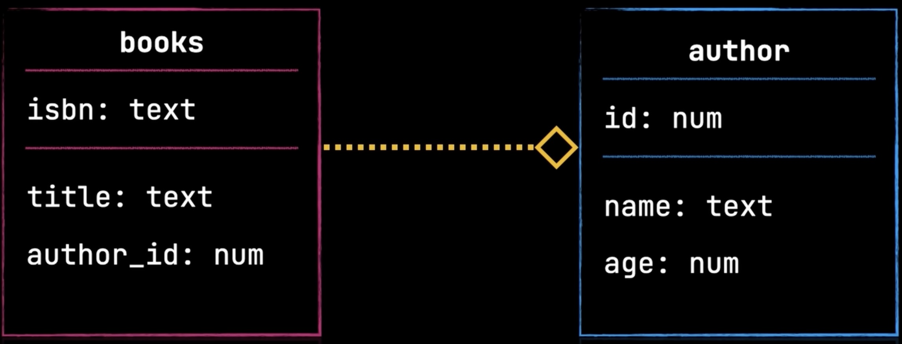
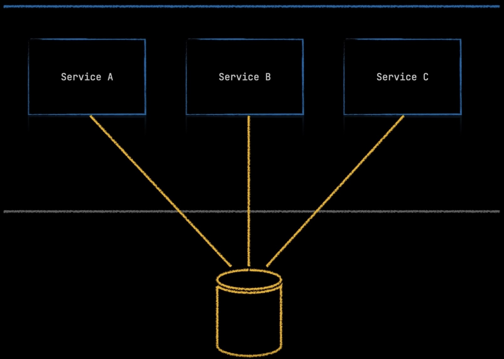
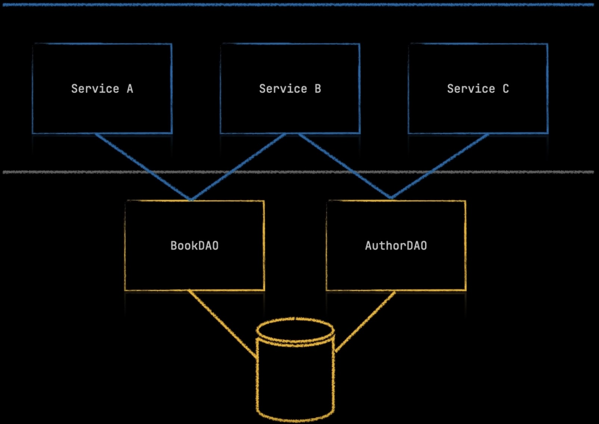
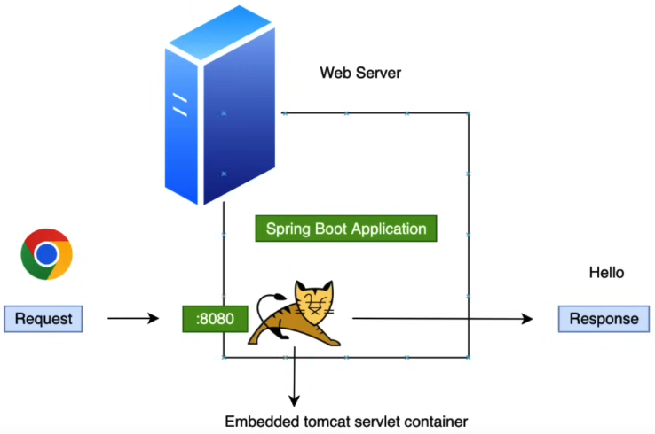
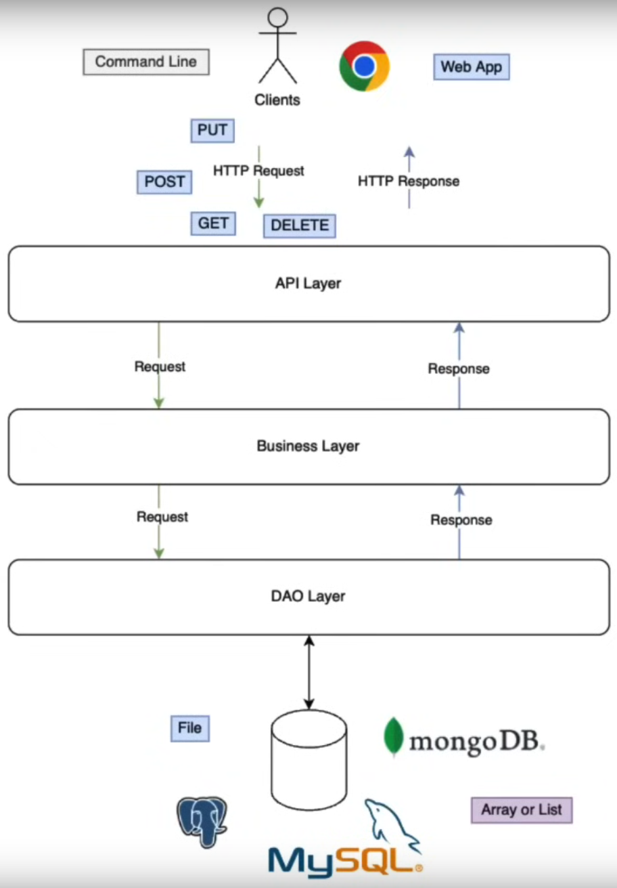
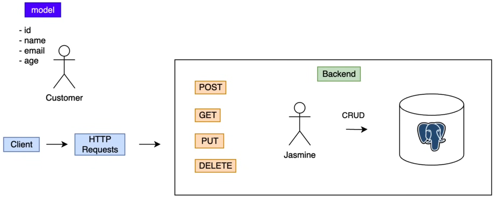
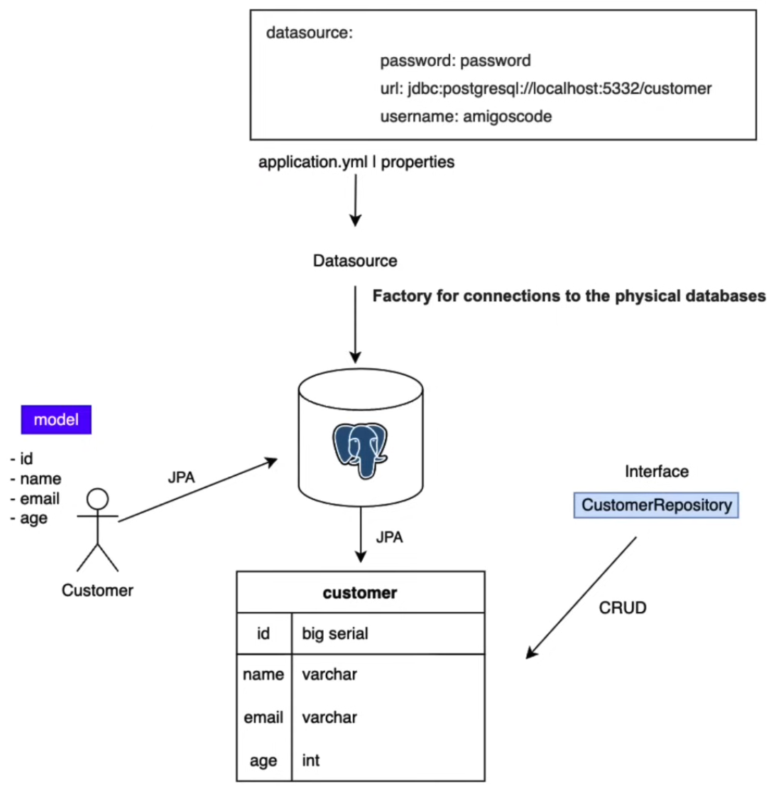

# Table of Contents

- [Table of Contents](#table-of-contents)
- [Official Docs](#official-docs)
- [Playground](#playground)
  - [Simple Rest API (No DB)](#simple-rest-api-no-db)
- [Resources](#resources)
- [Miscellaneous](#miscellaneous)
  - [Dependency Injection (DI)](#dependency-injection-di)
  - [Inversion of Control (IOC)](#inversion-of-control-ioc)
- [Spring Boot - Devtiro](#spring-boot---devtiro)
  - [QuickStart](#quickstart)
    - [Spring Initializr](#spring-initializr)
  - [Building the QuickStart App](#building-the-quickstart-app)
  - [Quickstart App Explainer](#quickstart-app-explainer)
  - [Apache Maven (build tool)](#apache-maven-build-tool)
    - [Maven Concepts](#maven-concepts)
      - [mvnw clean](#mvnw-clean)
      - [mvnw default](#mvnw-default)
      - [mvnw site](#mvnw-site)
    - [Maven Project Structure](#maven-project-structure)
    - [Maven Workflow](#maven-workflow)
    - [Maven Spring Boot Plugin](#maven-spring-boot-plugin)
  - [Spring Framework vs Spring Boot](#spring-framework-vs-spring-boot)
    - [Spring App Layers](#spring-app-layers)
      - [Persistence Layer](#persistence-layer)
      - [Service Layer](#service-layer)
      - [Presentation Layer](#presentation-layer)
    - [Modularity](#modularity)
  - [Inversion of Control + Dependency Injection](#inversion-of-control--dependency-injection)
  - [Beans](#beans)
    - [Method 1: Via Configuration File](#method-1-via-configuration-file)
    - [Method 2: Via `@Component` Annotation/Decorator](#method-2-via-component-annotationdecorator)
  - [Component Scanning](#component-scanning)
  - [`@SpringBootApplication` Annotation/Decorator](#springbootapplication-annotationdecorator)
  - [`@AutoConfiguration` Annotation/Decorators](#autoconfiguration-annotationdecorators)
  - [Config Files](#config-files)
  - [Environment Variables](#environment-variables)
  - [Configuration Properties](#configuration-properties)
    - [`@ConfigurationProperties` Annotation/Decorator](#configurationproperties-annotationdecorator)
    - [`@Configuration` Annotation/Decorator](#configuration-annotationdecorator)
  - [Database Layers](#database-layers)
  - [Connect to H2 Database (In-Memory DB)](#connect-to-h2-database-in-memory-db)
  - [Connect to PostgreSQL](#connect-to-postgresql)
    - [Starting PostgreSQL Container](#starting-postgresql-container)
    - [Initialise DB Schema](#initialise-db-schema)
  - [JDBCTemplate Setup](#jdbctemplate-setup)
  - [Data Access Objects (DAO)](#data-access-objects-dao)
    - [Setup DAO](#setup-dao)
      - [Integration Test DAO with H2 In-Memory DB](#integration-test-dao-with-h2-in-memory-db)
    - [Creating DAOs](#creating-daos)
      - [Author](#author)
      - [Book](#book)
- [Spring Boot 3 - Amigoscode](#spring-boot-3---amigoscode)
  - [Spring Initializr](#spring-initializr-1)
  - [Project Setup](#project-setup)
  - [pom.xml](#pomxml)
  - [Getting Started](#getting-started)
    - [Deleting Default Files](#deleting-default-files)
    - [Starting From Scratch](#starting-from-scratch)
  - [Embedded Web Server (Apache Tomcat)](#embedded-web-server-apache-tomcat)
  - [Configuring Embedded Web Server](#configuring-embedded-web-server)
  - [First API](#first-api)
  - [Annotations/Decorators](#annotationsdecorators)
    - [Spring Boot](#spring-boot)
    - [`@SpringBootApplication`](#springbootapplication)
      - [`@EnableAutoConfiguration`](#enableautoconfiguration)
    - [Spring](#spring)
      - [`@Bean`](#bean)
      - [`@Component`](#component)
      - [`@ComponentScan`](#componentscan)
      - [`@Configuration`](#configuration)
      - [`@Service`](#service)
      - [`@Repository`](#repository)
      - [`@Autowired`](#autowired)
      - [`@Qualifier`](#qualifier)
      - [`@PropertySource`](#propertysource)
    - [Spring Web MVC](#spring-web-mvc)
      - [`@Controller`](#controller)
      - [`@RestController`](#restcontroller)
      - [`@ResponseBody`](#responsebody)
      - [`@RequestBody`](#requestbody)
      - [`@RequestMapping(method=RequestMethod.GET, value="/path")`](#requestmappingmethodrequestmethodget-valuepath)
      - [`@GetMapping(value="/path")`](#getmappingvaluepath)
      - [`@PostMapping(value="/path")`](#postmappingvaluepath)
      - [`@PutMapping(value="/path")`](#putmappingvaluepath)
      - [`@DeleteMapping(value="/path")`](#deletemappingvaluepath)
      - [`@RequestParam(value="name", defaultValue="Hello")`](#requestparamvaluename-defaultvaluehello)
      - [`@PathVariable("placeholderName")`](#pathvariableplaceholdername)
  - [JSON for Java](#json-for-java)
    - [Records](#records)
  - [Java Objects to JSON Objects](#java-objects-to-json-objects)
  - [N Tier Diagram](#n-tier-diagram)
  - [Model](#model)
  - [DB + JPA Overview](#db--jpa-overview)
  - [PostgreSQL + Docker](#postgresql--docker)
  - [Installing PostgreSQL Driver and Spring Data JPA Dependencies](#installing-postgresql-driver-and-spring-data-jpa-dependencies)
- [Spring MVC - Teddy](#spring-mvc---teddy)
  - [MVC](#mvc)
    - [Controller Layer](#controller-layer)
    - [Model Layer](#model-layer)
    - [View Layer](#view-layer)
    - [Dispatcher Servlet](#dispatcher-servlet)
- [Spring Boot - Teddy](#spring-boot---teddy)
  - [Intro](#intro)
  - [Spring Intialiser](#spring-intialiser)
  - [File Structure](#file-structure)
  - [Architecture Overview](#architecture-overview)
    - [Spring Core](#spring-core)
    - [Infrastructure](#infrastructure)
    - [Data Access](#data-access)
    - [Web](#web)
    - [Repository Pattern / Dependency Injection / Inversion of Control](#repository-pattern--dependency-injection--inversion-of-control)
  - [Models](#models)
    - [Method 1 (Traditional)](#method-1-traditional)
    - [Method 2 (Lombok)](#method-2-lombok)
  - [Setup Spring Data](#setup-spring-data)
    - [Spring Data JPA](#spring-data-jpa)
  - [Controllers](#controllers)
    - [Testing API with Postman](#testing-api-with-postman)
  - [`@PathVariable`](#pathvariable)
  - [`@RequestBody`](#requestbody-1)
  - [JpaRepository + N-Tier Architecture](#jparepository--n-tier-architecture)
    - [Control Flow](#control-flow)
    - [Inheritance Flow](#inheritance-flow)
  - [Services \& Autowired](#services--autowired)
    - [Data Transfer Object (DTO)](#data-transfer-object-dto)
  - [GetAll + Mapping](#getall--mapping)
  - [Exception Handling](#exception-handling)
    - [Per Exception](#per-exception)
    - [Per Controller](#per-controller)
    - [Global Exception Handling](#global-exception-handling)
  - [Detail + Update + Delete Pokemon Endpoints](#detail--update--delete-pokemon-endpoints)
  - [Pagination](#pagination)
  - [One-To-Many Relationships](#one-to-many-relationships)
  - [Query Methods](#query-methods)
    - [Insert Raw SQL](#insert-raw-sql)
    - [Pokemon Project Continued](#pokemon-project-continued)
  - [Detail + Update + Delete Review Endpoints](#detail--update--delete-review-endpoints)
    - [Review Exception](#review-exception)

# Official Docs

- [Spring Boot Docs](https://spring.io/projects/spring-boot)
- [Spring Boot Reference Documentation](https://docs.spring.io/spring-boot/docs/current/reference/htmlsingle/)

# Playground

## Simple Rest API (No DB)

Test with Postman

- URL: GET `http://localhost:8080/api/hello`
- URL: GET `http://localhost:8080/api/users`
- URL: POST `http://localhost:8080/api/users/create`
  - Request Body: Raw JSON `{ "name": "Seth", "age": 22, "skills": ["HTML", "CSS", "ReactJS", "TypeScript", "NextJS"] }`
  - Request Body: Raw JSON `{ "name": "Bob", "age": 23, "skills": ["CPP", "Rust", "Go"] }`

```java
// src/main/java/com/demo/Main.java
package com.demo;

import java.util.*;

import org.springframework.boot.autoconfigure.SpringBootApplication;
import org.springframework.boot.SpringApplication;
import org.springframework.web.bind.annotation.DeleteMapping;
import org.springframework.web.bind.annotation.GetMapping;
import org.springframework.web.bind.annotation.PathVariable;
import org.springframework.web.bind.annotation.PostMapping;
import org.springframework.web.bind.annotation.PutMapping;
import org.springframework.web.bind.annotation.RequestBody;
import org.springframework.web.bind.annotation.RequestMapping;
import org.springframework.web.bind.annotation.RestController;
// import org.springframework.web.bind.annotation.*;

@SpringBootApplication
@RestController
@RequestMapping(value = "/api")
public class Main {
  private List<User> users = new ArrayList<>();

  public static void main(String[] args) {
    SpringApplication.run(Main.class, args);
  }

  @GetMapping("/hello")
  public User hello() {
    return new User("Sam", 22, List.of("Java", "TypeScript", "Go"));
  }

  @GetMapping("/users")
  public List<User> getAllUsers() {
    return users;
  }

  @PostMapping("/users/create")
  public void createUser(@RequestBody User user) {
    users.add(user);
  }

  record User(String name, int age, List<String> skills) {}
}
```

# Resources

- [Spring Boot - Teddy Smith](https://www.youtube.com/playlist?list=PL82C6-O4XrHfX-kHudgC4cPfMy6QPaF-H)
  - [GitHub Repo](https://github.com/teddysmithdev/pokemon-review-springboot)
- [Spring MVC - Teddy Smith](https://www.youtube.com/playlist?list=PL82C6-O4XrHejlASdecIsroNEbZFYo_X1)
  - [GitHub Repo](https://github.com/teddysmithdev/RunGroop-Java)
- [Spring Boot 3 - Amigoscode](https://www.youtube.com/watch?v=-mwpoE0x0JQ)
- [Spring Boot - Amigoscode](https://www.youtube.com/watch?v=9SGDpanrc8U)
- [Spring Boot - Devtiro](https://www.youtube.com/watch?v=Nv2DERaMx-4)

# Miscellaneous

## Dependency Injection (DI)

- Remove the `new` keyword in all classes/code
- Delegate/leave creation and management of objects to frameworks (Spring/Guice/Dagger)
- Objects are created by default as a singleton (meaning if injected into multiple classes, the same instance will be reused and hence greatly benefits horizontal scaling)
- [YouTube Link - Amigoscode](https://www.youtube.com/watch?v=oqYRl06DNHQ)

**BEFORE Dependency Injection**

```java
public class EmailService {
  private final ContactListService contactListService;

  public EmailService() {
    this.contactListService = new ContactListService();
  }

  sendEmail() {
    contactListService.getContacts().forEach(() -> contactListService::send);
  }
}

public class MailChimpEmailService {
  private final ContactListService contactListService;

  public MailChimpEmailService() {
    this.contactListService = new ContactListService();
  }

  sendEmail() {
    contactListService.getContacts().forEach(() -> contactListService::send);
  }
}

public class ContactListService {
  public ContactListService() {
    //...
  }

  public List<Contacts> getContacts() {
    // db operation...
    return ImmutableList.copyOf(...);
  }

  void send(Contact contact) {
    //...
  }
}
```

**AFTER Dependency Injection**

```java
public class EmailService {
  private final ContactListService contactListService;

  @Inject
  public EmailService(ContactListService contactListService) {
    this.contactListService = contactListService;
  }

  sendEmail() {
    contactListService.getContacts().forEach(() -> contactListService::send);
  }
}

public class MailChimpEmailService {
  private final ContactListService contactListService;

  @Inject
  public MailChimpEmailService(ContactListService contactListService) {
    this.contactListService = contactListService;
  }

  sendEmail() {
    contactListService.getContacts().forEach(() -> contactListService::send);
  }
}

@Service
public class ContactListService {
  public ContactListService() {
    //...
  }

  public List<Contacts> getContacts() {
    // db operation...
    return ImmutableList.copyOf(...);
  }

  void send(Contact contact) {
    //...
  }
}
```

## Inversion of Control (IOC)

- Traditional Procedural Programming is where Class A uses methods from Class B i.e. Class A depends on Class B
- Class A would instantiate (have a a copy of) Class B within itself

```java
public class User {
  MySQLDatabase db;

  public User() {
    this.db = new MySQLDatabase();
  }

  public void add(String data) {
    db.persist(data);
  }
}
```

Procedural Programming Flow of Control

```
                                Main
                    ------------|  |------------
                    |                          |
                    v                          v
              High Level Func             High Level Func
                    |                          |
                    v                          v
              Mid Level Func             Mid Level Func
                    |                          |
                    v                          v
```

Structured Inversion of Control (IOC)

- Instead of the user initialising/instantiating another object, the user would use a framework (or higher up dependency) to initialise/instantiate the database instance for the user and pass it to user as a parameter to use
- Therefore the user relinquishes all responsibility of the database object and depend more upon abstractions rather than concrete implementations which promotes loosely coupled architecture and greater flexibility within code

```
                                Main
                                ^  ^
                    ------------|  |------------
                    ^                          ^
                    |                          |
              High Level Func             High Level Func
                    ^                          ^
                    |                          |
              Mid Level Func             Mid Level Func
                    ^                          ^
                    |                          |
```

- Inversion of Control (IOC):

  - Objects do NOT create other objects on which they rely to do their work
  - Instead, they get the objects that they need from an outside source (e.g. a framework or an xml configuration file)

- Dependency Injection (DI):
  - Dependency injection generally means passing a dependent object as a parameter to a method, rather than having the method instantiate/create the dependent object itself
  - What it means in practice is that the method does NOT have a direct dependency on a particular implementation; any implementation that meets the requirements can be passed as a parameter
  - Previously Spring Boot used the `@Autowired` annotation/decorator
  - Currently Spring Boot uses "Constructor-Based Dependency Injection" where we place the required dependencies in the class/object's own constructor (see code below)

```java
// src/main/java/com/demo/Main.java
package com.demo;

import java.util.*;

import org.springframework.boot.autoconfigure.SpringBootApplication;
import org.springframework.boot.SpringApplication;
import org.springframework.web.bind.annotation.*;

@SpringBootApplication
@RestController
@RequestMapping(value = "/api")
public class Main {
  private final UserRepo userRepo;

  public static void main(String[] args) {
    SpringApplication.run(Main.class, args);
  }

  public Main(UserRepo userRepo) { // <-- Constructor-based Dependency Injection HERE
    this.userRepo = userRepo;
  }

  //...
}
```

# Spring Boot - Devtiro

- [YouTube Link](https://www.youtube.com/watch?v=Nv2DERaMx-4)
- [GitHub Repo](https://github.com/devtiro/course-spring-boot)

## QuickStart

### Spring Initializr

- [Spring Initializr](https://start.spring.io/)
  - Spring Initialiser allows you to configure and download a skeleton spring boot project
- Note:

  - Gradle is a build and dependency management tool
  - Kotlin, Groovy are other programming languages

- Config Options:
  - Project = `Maven`
  - Language = `Java`
  - Spring Boot = `3.2.3` (do NOT choose SNAPSHOT)
  - Project Metadata:
  - Group: `com.demo`
  - Artifact: `quickstart`
  - Name: `quickstart`
  - Description: `Demo project for Spring Boot`
  - Package Name: `com.demo.quickstart`
  - Packaging: `jar`
  - Java: `17`
  - Dependencies
  - `Spring Web`

## Building the QuickStart App

- Create `src/main/java/com.demo.quickstart/HelloWorldController.java`
- Paste in the following code below and go to `http://localhost:8080/hello`

```java
// src/main/java/com/devtiro/quickstart/HelloWorldController.java
package com.devtiro.quickstart;

import org.springframework.web.bind.annotation.GetMapping;
import org.springframework.web.bind.annotation.RestController;

@RestController
public class HelloWorldController {

  @GetMapping(path = "/hello")
  public String helloWorld() {
    return "Hello Devtiro!";
  }
}
```

```java
// src/main/java/com/devtiro/quickstart/QuickstartApplication.java
package com.devtiro.quickstart;

import org.springframework.boot.SpringApplication;
import org.springframework.boot.autoconfigure.SpringBootApplication;

@SpringBootApplication
public class QuickstartApplication {

  public static void main(String[] args) {
    SpringApplication.run(QuickstartApplication.class, args);
  }
}
```

## Quickstart App Explainer

- `src/main/java/com/devtiro/quickstart/QuickstartApplication.java` = Entry point to application (can tell by the `main` method and the `@SpringBootApplication` annotation)
- `src/main/resources/application.properties` or `src/main/resources/application.yml` = App configurations -`~/pom.xml` = Used by Maven

## Apache Maven (build tool)

- Apache Maven = A build tool that helps programmers manage their projects and all things they need to build their programs
- Maven knows how to find, find and bundle all project dependencies (dependency management)
- Maven builds and tests our projects as well as package it up
- `./mvnw clean compile`

### Maven Concepts

- `mvnw` == Maven Wrapper
- Maven has 3 phases (lifecycle) with 1 or more goals
  - `clean`
  - `default`
  - `site`
- `~/target` folder/directory is directory that Maven uses to store all processed code (built classes, reports, build artifacts (jar, war files))
  - Remove with `./mvnw clean`

#### mvnw clean

- `clean` === Remove temporary directories and files
  - `pre-clean` - Hook for before cleaning
  - `clean` - Does the actual cleaning
  - `post-clean` - Hook for after cleaning

#### mvnw default

- `default` - Where we build and test (where most useful goals live)
  - `compile` - Compiles code into bytecode
  - `test` - Runs unit tests
  - `package` - Creates a jar/war file
  - `verify` - Runs and checks integration tests
- Note: These goals are run in the order that they are listed
  - Example
    - `./mvnw test` will run both `compile` and `test`
    - `./mvnw package` will run `compile` > `test` > `package`

#### mvnw site

`site` == Where documentation is generated (i.e. javadoc)

### Maven Project Structure

- [Introduction to the Standard Directory Layout Docs](https://maven.apache.org/guides/introduction/introduction-to-the-standard-directory-layout.html)
- `src/main/java` = All Java implementation code
- `src/main/resources` = Folder for any static/configuration/load-in files
  - Contains `application.yml`/`application.properties` file
- `src/test/java` = All Java test code
  - Mirror your `src/main/java` folder structure
- ` src/main/test/resources`
  - Place any TEST-SPECIFIC static/configuration/load-in files here (to overwrite configuration files)
- `~/target` = Built project (compiled jar file) + Any files processed by Maven

### Maven Workflow

- `./mvnw clean compile`
- `./mvnw clean test`
- `./mvnw clean package`
- `./mvnw clean verify`
- Run jar file `java -jar pathToJarFile`
  - `java -jar quickstart-0.0.1-SNAPSHOT.jar`

### Maven Spring Boot Plugin

- Run application
  - `./mvn spring-boot:run`
- Stop application
  - `ctrl + c`

## Spring Framework vs Spring Boot

- Spring Boot is a framework for building Java applications
  - A framework is a chunk of code written on top of a language's core library to solve common problems (i.e. connecting to db, exposing a REST API so different parts of system can communicate)
- "Spring Boot" is built ON-TOP of "Spring Framework"

```
Your App
|
Spring Boot
|
Spring Framework
|
Java Language Core Library
```

### Spring App Layers

```
Presentation
|
Service
|
Persistence
```

#### Persistence Layer

- Persistence Layer handles interactions with our database and expose via interfaces
  - Entities == Java objects which represent our domain and often map to tables in a db
- Use entities to interact with db with the following patterns:
  - Repository Pattern
  - Data Access Objects (DAO)
- Type of functionality exposed by our repositories & dao's would typically be "CRUD"
  - Create
  - Read
  - Update
  - Delete

#### Service Layer

- Service Layer uses all the functionality exposed by the "Persistance Layer" to meet requirements of application
  - This is achieved through a set of interfaces and their implementing classes (referred to as "services")
- The Service Layer's functionality can be complicated or simply pass-through calls to the "Persistence Layer"

#### Presentation Layer

- Presentation Layer takes all the data (from using services in the "Service Layer") and expose them to the user through APIs such as:
  - A REST API (using controllers and their implementations)
  - GraphQL API
  - Websockets API

### Modularity

- Essentially just utilise spring dependencies, put configuration inside proxies file (specifying how to connect to db) and get spring boot to automatically create beans for you

```
Spring Data JPA (Java Objects)
|
Spring JDBC (SQL)
|
Database Driver (e.g. PostgreSQL)
```

## Inversion of Control + Dependency Injection

- Rely on "interfaces" rather than "classes", which makes it easier to swap out sub-classes that a main class depends on
- Left to framework to create concrete classes and inject them where they are needed/declared
- Ownership of objects/dependencies is left to higher classes (i.e. frameworks)
- Hence we do NOT use the `new` keyword
- Note: "Dependency Injection" sits INSIDE "Inversion of Control"

## Beans

- Beans == Concrete Classes that are injected by a framework
  - **Bean dependencies are declared in the bean's constructor**
- `@Configuration` annotation/decorator
  - Labels a "Configuration Class"
  - Tells Spring to look inside class for `@Bean` annotations/decorators
- `@Bean` annotation declares component is a bean that will be managed by Spring context
- Note: `CommandLineRunner` == Spring Boot CLI Application

### Method 1: Via Configuration File

- Note: Need to create `src/main/java/com/demo/config` folder

```java
// src/main/java/com/devtiro/maven/config/PrinterConfig.java
package com.devtiro.maven.config;

import com.devtiro.maven.services.BluePrinter;
import com.devtiro.maven.services.ColourPrinter;
import com.devtiro.maven.services.GreenPrinter;
import com.devtiro.maven.services.RedPrinter;
import com.devtiro.maven.services.impl.*;
import org.springframework.context.annotation.Bean;
import org.springframework.context.annotation.Configuration;

@Configuration
public class PrinterConfig {

  @Bean
  public BluePrinter bluePrinter() {
    return new SpanishBluePrinter();
  }

  @Bean
  public RedPrinter redPrinter() {
    return new SpanishRedPrinter();
  }

  @Bean
  public GreenPrinter greenPrinter() {
    return new SpanishGreenPrinter();
  }

  @Bean
  public ColourPrinter colourPrinter(BluePrinter bluePrinter, RedPrinter redPrinter, GreenPrinter greenPrinter) {
    return new ColourPrinterImpl(redPrinter, bluePrinter, greenPrinter);
  }
}
```

```java
// src/main/java/con/devtiro/maven/services/RedPrinter.java
package com.devtiro.maven.services;

public interface RedPrinter {
  String print();
}
```

```java
// src/main/java/con/devtiro/maven/services/impl/EnglishRedPrinter.java
package com.devtiro.maven.services.impl;

import com.devtiro.maven.services.RedPrinter;

public class EnglishRedPrinter implements RedPrinter {

  @Override
  public String print() {
    return "red";
  }
}
```

```java
// src/main/java/con/devtiro/maven/services/ColorPrinter.java
package com.devtiro.maven.services;

public interface ColourPrinter {
  String print();
}
```

```java
// src/main/java/con/devtiro/maven/services/impl/ColorPrinterImpl.java
package com.devtiro.maven.services.impl;

import com.devtiro.maven.services.BluePrinter;
import com.devtiro.maven.services.ColourPrinter;
import com.devtiro.maven.services.GreenPrinter;
import com.devtiro.maven.services.RedPrinter;

public class ColourPrinterImpl implements ColourPrinter {
  private RedPrinter redPrinter;
  private BluePrinter bluePrinter;
  private GreenPrinter greenPrinter;

  public ColourPrinterImpl(RedPrinter redPrinter, BluePrinter bluePrinter, GreenPrinter greenPrinter) {
    this.redPrinter = redPrinter;
    this.bluePrinter = bluePrinter;
    this.greenPrinter = greenPrinter;
  }

  @Override
  public String print() {
    return String.join(", ", redPrinter.print(), bluePrinter.print(), greenPrinter.print());
  }
}
```

```java
// src/main/java/com/devtiro/maven/ColorsApplication.java
package com.devtiro.maven;

import com.devtiro.maven.services.ColourPrinter;
import lombok.extern.java.Log;
import org.springframework.boot.CommandLineRunner;
import org.springframework.boot.SpringApplication;
import org.springframework.boot.autoconfigure.SpringBootApplication;

@SpringBootApplication
@Log
public class ColoursApplication implements CommandLineRunner {

  private ColourPrinter colourPrinter;

  public ColoursApplication(ColourPrinter colourPrinter) {
    this.colourPrinter = colourPrinter;
  }

  public static void main(String[] args) {
    SpringApplication.run(ColoursApplication.class, args);
  }

  @Override
  public void run(final String... args) {
    log.info(colourPrinter.print());
  }
}
```

### Method 2: Via `@Component` Annotation/Decorator

- `@Component` annotation/decorator
  - Declares component is a bean that will be managed by Spring context
  - Asks Spring to inject any dependencies the class requires in its constructor (or any other way of declaring dependencies)
  - Add `@Component` on top of the implementing class instead of adding `@Bean` declaration inside a configuration class
- Note:
  - `RedPrinter.java`, `ColorPrinter.java`, `ColorsApplication.java` remains unchanged
- To swap out `EnglishRedPrinter` with `SpanishRedPrinter` in `ColorPrinterImpl.java`
  - All we need to do is REMOVE `@Component` from `EnglishRedPrinter.java` and ADD `@Component` into `SpanishRedPrinter.java`
- The `@Service` annotation/decorator is a more specific version of the `@Component` annotation/decorator which specifies that the component is a "service" bean
  - `@Component` and `@Service` are interchangeable

```java
// src/main/java/com/devtiro/maven/services/impl/EnglishRedPrinter.java
package com.devtiro.maven.services.impl;

import com.devtiro.maven.services.RedPrinter;
import org.springframework.stereotype.Component;

@Component
public class EnglishRedPrinter implements RedPrinter {

  @Override
  public String print() {
    return "red";
  }
}
```

```java
// src/main/java/com/devtiro/maven/services/impl/ColorPrinterImpl.java
package com.devtiro.maven.services.impl;

import com.devtiro.maven.services.BluePrinter;
import com.devtiro.maven.services.ColourPrinter;
import com.devtiro.maven.services.GreenPrinter;
import com.devtiro.maven.services.RedPrinter;
import org.springframework.stereotype.Component;

@Component
public class ColourPrinterImpl implements ColourPrinter {
  private RedPrinter redPrinter;
  private BluePrinter bluePrinter;
  private GreenPrinter greenPrinter;

  public ColourPrinterImpl(RedPrinter redPrinter, BluePrinter bluePrinter, GreenPrinter greenPrinter) {
    this.redPrinter = redPrinter;
    this.bluePrinter = bluePrinter;
    this.greenPrinter = greenPrinter;
  }

  @Override
  public String print() {
    return String.join(", ", redPrinter.print(), bluePrinter.print(), greenPrinter.print());
  }
}
```

## Component Scanning

- Component scanning is a process that starts whenever the application is run
- Spring will look through your project for beans and where beans are needed
  - No dependency example: `EnglishRedPrinter.java`
    - `@Component` scan will create an instance of the class and place it as a bean into the "spring application context" (a global pool of beans that are available for use)
  - Dependency example: `ColorPrinterImpl.java`
    - Has dependencies of `RedPrinter`, `BluePrinter`, `GreenPrinter` as declared as arguments in its constructor
    - "Autowiring" is another term for "Dependency Injection"
- Component scanning starts at a particular point of project hierarchy and works its way down the tree
  - Traditionally would use `@ComponentScan` annotation/decorator to tell Spring the starting point
  - In Spring Boot we use the `@SpringBootApplication` annotation/decorator which implicitly contains the `@ComponentScan` annotation/decorator
    - We will declare `@ComponentScan` at a point in our project and everywhere from that point downwards will be searched by Spring for beans and places where beans are needed/required

## `@SpringBootApplication` Annotation/Decorator

- `@SpringBootApplication` contains
  - `@Configuration`: Identifies configuration class (somewhere that Spring should look for beans during component scanning phase)
  - `@ComponentScan`: From this point in the project hierarchy down, look for beans and places where beans are needed/required
  - `@EnableAutoConfiguration`: Load predefined defaults

## `@AutoConfiguration` Annotation/Decorators

- `@AutoConfiguration` is the process that Spring Boot uses when it starts up to provide the predefined defaults and create all those dependencies
- Spring boot starters are a collection of those dependencies which are there to solve a particular problem
  - One such start is the "Spring Web" dependency
- After creating a demo project with "Spring Initializr" and adding the "Spring Web" dependency
  - Open project and look at the `pom.xml` file
    - Can see `<artifactId>spring-boot-starter-web</artifactId>`
    - `sprint-boot-starter-web` is a collection of dependencies that we need inorder to implement a web project including Spring MVC and the embedded Tomcat = web server application container needed to run the web project
- To find `@AutoConfiguration` go to "External Libraries" in Intellij
  - `External Libaries > Maven: org.springframework.boot:spring-boot-autoconfigure:3.1.1 > spring-boot-autoconfigure-3.1.1.jar > org.springframework.boot.autoconfigure > web`
    - The classes inside this folder will:
      - Look at all the dependencies available in our project (such as ones provided by the spring-boot starters)
      - Create objects with predefined defaults
      - Place resultant beans into the spring application context to be used throughout our application
    - `External Libaries > Maven: org.springframework.boot:spring-boot-autoconfigure:3.1.1 > spring-boot-autoconfigure-3.1.1.jar > org.springframework.boot.autoconfigure > web > servlet > DispatcherServletAutoConfiguration.java`
      - `@ConditionalOnClass` annotation/decorator
        - `@ConditionalOnClass({DispatcherServlet.class})` == When this class (`DispatcherServlet.class`) is available on your class path, the following class (`DispatcherServletAutoConfiguration`) should be instantiated and run
        ```java
        @ConditionalOnClass({DispatcherServlet.class})
        public class DispatcherServletAutoConfiguration {
          //...
        }
        ```
      - `@ConditionalOnBean` == When this bean (`DispatcherServlet.class`) is available, then this particular part of the configuration should be run
        - Note: The inverse is possible as well (`@ConditonalOnMissingBean`)
        ```java
        @ConditionalOnBean(value = {DispatcherServlet.class},name = {"dispatcherServlet"})
        public DispatcherServletRegistrationBean dispatcherServletRegistration(DispatcherServlet dispatcherServlet, WebMvcProperties webMvcProperties, ObjectProvider<MultipartConfigElement> multipartConfig) {herServletRegistrationBean dispatcherServletRegistration(DispatcherServlet dispatcherServlet, WebMvcProperties webMvcProperties, ObjectProvider<MultipartConfigElement> multipartConfig) {
          //...
        }
        ```

## Config Files

- Use config files to change predefined defaults
- Change these defaults with the `src/main/resources/application.properties` file
  - Using a `src/main/resources/application.ymnl` file also works
- Note: You can also change config for your `src/test` folder by creating an `application.properties` or `application.yml` file
  - E.g. Is to use an in-memory db for tests (done by placing the db in `src/test/resources`)
- Note:
  - `.properties` files use `key=value`
  - `.yaml/.yml` files use indentations
- [Docs Link](https://docs.spring.io/spring-boot/docs/current/reference/html/application-properties.html)

Example of changing server port

```conf
# src/main/resources/application.properties
server.port=8181
```

```yaml
# src/main/resources/application.yml
server:
  port: 8181
```

## Environment Variables

- Spring Boot can load configuration from config files, command line arguments (cli) and from environment variables
- Convert key value pair (`key=value`) to environment variable
  - Make key UPPERCASE
  - Replace delimiters (`.`, `-`) with hyphen (`_`)

```conf
server.port=8181
SERVER_PORT=8181
```

**Method 1 (Intellij)**

- `In top toolbar > Quickstart Application > "Edit Configurations..." > Environment variables`
  - Add `SERVER_PORT=8181`

**Method 2 (CLI)**

- Method 2.1: `SERVER_PORT=8282 ./mvnw spring-boot:run`
- Method 2.2: `export SERVER_PORT=8383` && `./mvnw spring-boot:run`

- Note: Both these methods works when run via jar file

```conf
# Package up application
./mvnw package
cd target
java -jar quickstart-0.0.1-SNAPSHOT.jar
```

## Configuration Properties

- Custom configuration for custom code but loaded in same way as other configuration
- Lombok
  - `@Data` annotation/decorator = Makes it a data class (getters, setters, equals, hashcode generated automatically)

BEFORE Dependency Injection

```java
// src/main/java/com/devtiro/configuration/PizzaApplication.java
package com.devtiro.configuration;

import com.devtiro.configuration.config.PizzaConfig;
import lombok.extern.java.Log;
import org.springframework.boot.CommandLineRunner;
import org.springframework.boot.SpringApplication;
import org.springframework.boot.autoconfigure.SpringBootApplication;

@SpringBootApplication
@Log
public class PizzaApplication implements CommandLineRunner {

  public static void main(String[] args) {
    SpringApplication.run(PizzaApplication.class, args);
  }

  @Override
  public void run(final String... args) {
    final PizzaConfig pizzaConfig = new PizzaConfig("tomato", "mozzarella", "thin");

    log.info(String.format("I want a %s crust pizza, with %s and %s sauce", pizzaConfig.getCrust(), pizzaConfig.getTopping(), pizzaConfig.getSauce()));
  }
}
```

AFTER Dependency Injection

```java
// src/main/java/com/devtiro/configuration/PizzaApplication.java
package com.devtiro.configuration;

import com.devtiro.configuration.config.PizzaConfig;
import lombok.Builder;
import lombok.extern.java.Log;
import org.springframework.boot.CommandLineRunner;
import org.springframework.boot.SpringApplication;
import org.springframework.boot.autoconfigure.SpringBootApplication;

@SpringBootApplication
@Log
public class PizzaApplication implements CommandLineRunner {
  private PizzaConfig pizzaConfig; // <-- Injecting Dependency HERE

  public PizzaApplication(PizzaConfig pizzaConfig) { // <-- Constructor Dependency Injection HERE
    this.pizzaConfig = pizzaConfig;
  }

  public static void main(String[] args) {
    SpringApplication.run(PizzaApplication.class, args);
  }

  @Override
  public void run(final String... args) {
    log.info(String.format("I want a %s crust pizza, with %s and %s sauce", pizzaConfig.getCrust(), pizzaConfig.getTopping(), pizzaConfig.getSauce()));
  }
}
```

### `@ConfigurationProperties` Annotation/Decorator

- `@ConfigurationProperties` annotation/decorator declares class as ConfigurationProperties class
- `@ConfigurationProperties` annotation/decorator has a very important argument: `prefix`
  - This `prefix` is the prefix of the key that spring will look for inside of your configuration properties/yaml file and environment variables

### `@Configuration` Annotation/Decorator

- `@Configuration` annotation/decorator tells Spring to look inside this class for beans

```java
// src/main/java/com/devtiro/configuration/config/PizzaConfig.java
package com.devtiro.configuration.config;

import lombok.AllArgsConstructor;
import lombok.Data;
import lombok.NoArgsConstructor;
import org.springframework.boot.context.properties.ConfigurationProperties;
import org.springframework.context.annotation.Configuration;

@Configuration // <-- HERE
@ConfigurationProperties(prefix = "pizza") // <-- HERE
@AllArgsConstructor
@NoArgsConstructor
@Data
public class PizzaConfig {
  private String sauce;
  private String topping;
  private String crust;
}
```

Note:

- `pizza` matches the prefix we provided in `PizzaConfig.java`
- `sauce`, `topping`, `crust` matches the instance variable names inside `PizzaConfig.java`

```conf
# src/main/resources/application.properties
pizza.sauce=bbq
pizza.topping=chicken
pizza.crust=stuffed
```

- Note: Can also mix and match different methods of configurating properties
  - E.g. Can remove `pizza.sauce=bbq` and add environment variable of `PIZZA_SAUCE=bbq`

## Database Layers

- Lowest layer = Database Driver
  - Allows you to interact with db from Java code
- Next layer = JDBC == Java Database Connectivity
  - Low level API == Allows you to connect to DB and interact with DB via SQL queries
  - Need to manually handle all the mapping to and from Java objects yourself
- Spring JDBC builds ontop of JDBC
  - Provides functionalities such as JDBC template (allows for db interaction via SQL even easier)
- Next layer = JPA = Java Persistence API
  - Allows you to interact with db using Java objects (query using Java objects)
  - JPA handles all the generation of SQL, the mapping to and from Java objects
  - Note: JPA is built ontop of JPBC (so its considered a high-level API)
  - Technically JPA is a specification
  - The actual implementation used by the Spring ecosystem = Hibernate
    - Note: Hibernate may be referred to as an ORM = Object Relational Mapper
      - Maps from SQL to Java Objects and vice versa
- Spring Data JPA builds ontop of JPA

```
Spring Data JPA <-  JPA
                     ^
                     |
Spring JDBC     <-  JDBC
                     ^
                     |
                Database Driver
```

## Connect to H2 Database (In-Memory DB)

- Create demo project/repo using Spring Initializr
  - Project: Maven
  - Language: Java
  - Spring Boot: Latest version (that is NOT SNAPSHOT)
  - Project Metadata
    - Group: com.devtiro
    - Artifact: database
    - Name: database
    - Description: Demo project for connecting to a database
    - Package name: com.devtiro.database
  - Packaging: Jar
  - Java: 17
  - Depedencies: Lombok, H2 Database, JDBC API

Note:

- We get the `log` instance from `@Log` (from Lombok)
- There are auto configures which if they find the H2 in-memory database on the class path, they will automatically create the beans needed in order to connect to the DB
  - We do NOT need to specify the username or password

```java
// src/main/java/com/devtiro/database/DatabaseApplication.java
package com.devtiro.database;

import lombok.extern.java.Log;
import org.springframework.boot.CommandLineRunner;
import org.springframework.boot.SpringApplication;
import org.springframework.boot.autoconfigure.SpringBootApplication;
import org.springframework.jdbc.core.JdbcTemplate;

import javax.sql.DataSource;

@SpringBootApplication
@Log
public class DatabaseApplication implements CommandLineRunner {
  private final DataSource dataSource; // <-- Injecting Dependency HERE

  public DatabaseApplication(final DataSource dataSource) { // <-- Constructor Dependency Injection HERE
    this.dataSource = dataSource;
  }

  public static void main(String[] args) {
    SpringApplication.run(DatabaseApplication.class, args);
  }

  @Override
  public void run(final String... args) {
    log.info("Datasource: " + dataSource.toString());
    final JdbcTemplate restTemplate = new JdbcTemplate(dataSource);
    restTemplate.execute("select 1");
  }
}
```

```conf
# src/main/resources/application.properties
spring.datasource.url=jdbc:h2:mem:testdb # "mem" == "in-memory"
spring.datasource.driverClassName=org.h2.Driver
spring.datasource.username=sa
spring.datasource.password=password
```

## Connect to PostgreSQL

- Create demo project/repo using Spring Initializr
  - Project: Maven
  - Language: Java
  - Spring Boot: Latest version (that is NOT SNAPSHOT)
  - Project Metadata
    - Group: com.devtiro
    - Artifact: database
    - Name: database
    - Description: Demo project for connecting to a database
    - Package name: com.devtiro.database
  - Packaging: Jar
  - Java: 17
  - Depedencies: Lombok, PostgreSQL Driver, JDBC API

Note:

- We get the `log` instance from `@Log` (from Lombok)
- There are auto configures which if they find the H2 in-memory database on the class path, they will automatically create the beans needed in order to connect to the DB
  - We do NOT need to specify the username or password

```java
// src/main/java/com/devtiro/database/DatabaseApplication.java
package com.devtiro.database;

import lombok.extern.java.Log;
import org.springframework.boot.CommandLineRunner;
import org.springframework.boot.SpringApplication;
import org.springframework.boot.autoconfigure.SpringBootApplication;
import org.springframework.jdbc.core.JdbcTemplate;

import javax.sql.DataSource;

@SpringBootApplication
@Log
public class DatabaseApplication implements CommandLineRunner {
  private final DataSource dataSource; // <-- Injecting Dependency HERE

  public DatabaseApplication(final DataSource dataSource) { // <-- Constructor Dependency Injection HERE
    this.dataSource = dataSource;
  }

  public static void main(String[] args) {
    SpringApplication.run(DatabaseApplication.class, args);
  }

  @Override
  public void run(final String... args) {
    log.info("Datasource: " + dataSource.toString());
    final JdbcTemplate restTemplate = new JdbcTemplate(dataSource); // Note: restTemplate == method to interact with DB
    restTemplate.execute("select 1");
  }
}
```

```yml
# src/docker-compose.yml
version: '3.1'

services:
  db:
    image: postgres
    ports:
      - '5432:5432'
    restart: always
    environment:
      POSTGRES_PASSWORD: pwd
```

```conf
# src/main/resources/application.properties
spring.datasource.url=jdbc:postgresql://localhost:5432/postgres
spring.datasource.username=postgres
spring.datasource.password=pwd
spring.datasource.driver-class-name=org.postgresql.Driver
```

### Starting PostgreSQL Container

```
docker-compose up
```

### Initialise DB Schema

- `schema.sql` = Set up the schema (run after connection to db is established)
- `data.sql` = Populating the tables created in `schema.sql`

```sql
-- src/main/resources/schema.sql
DROP TABLE IF EXISTS "widgets";
DROP SEQUENCE IF EXISTS widgets_id_seq;
CREATE SEQUENCE widgets_id_seq INCREMENT 1 MINVALUE 1 MAXVALUE 9223372036854775807 CACHE 1;
CREATE TABLE "widgets" (
  "id" bigint DEFAULT nextval('widgets_id_seq') NOT NULL,
  "name" text,
  "purpose" text,
  CONSTRAINT "widgets_pkey" PRIMARY KEY ("id")
);
```

```sql
-- src/main/resources/data.sql
INSERT INTO widgets (id, name, purpose)
VALUES (1, 'Widget A', 'Used for testing purposes.'),
  (2, 'Widget B', 'Designed for entertainment.'),
  (3, 'Widget C', 'Enhances productivity.'),
  (4, 'Widget D', 'Perfect for outdoor activities.'),
  (5, 'Widget E', 'Improves overall well-being.');
```

- `spring.sql.initl.mode=always` == Always RUN `schema.sql` and `data.sql` (use in non-prod only)

```conf
# src/main/resources/application.properties
spring.datasource.url=jdbc:postgresql://localhost:5432/postgres
spring.datasource.username=postgres
spring.datasource.password=pwd
spring.datasource.driver-class-name=org.postgresql.Driver
spring.sql.init.mode=always # <-- HERE
```

- Devtiro uses [DBeaver](https://dbeaver.io/) to view DB
  - Top left hand corner (establish connection to DB)

## JDBCTemplate Setup

- Note:
  - `schema.sql` and `data.sql` have been removed
  - `spring.sql.init.mode=always` has been removed from `src/main/applcation.properties`
  - `DatabaseApplication` does NOT implement `CommandLineRunner`
- Get `JDBCTemplate` via configuration class approach/method/way
  - Create `src/main/java/com/devtiro/database/config` folder
  - Create `src/main/java/com/devtiro/database/config/DatabaseConfig.java`
    - Add `@Configuration` annotation/decorator to specify this is a configuration class

```java
// src/main/java/com/devtiro/database/DatabaseApplication.java
package com.devtiro.database;

import lombok.extern.java.Log;
import org.springframework.boot.SpringApplication;
import org.springframework.boot.autoconfigure.SpringBootApplication;

@SpringBootApplication
@Log
public class DatabaseApplication {

  public static void main(String[] args) {
    SpringApplication.run(DatabaseApplication.class, args);
  }
}
```

```java
// src/main/java/com/devtiro/database/config/DatabaseConfig.java
package com.devtiro.database.config;

import org.springframework.context.annotation.Bean;
import org.springframework.context.annotation.Configuration;
import org.springframework.jdbc.core.JdbcTemplate;

import javax.sql.DataSource;

@Configuration
public class DatabaseConfig {

  @Bean
  public JdbcTemplate jdbcTemplate(final DataSource dataSource) {
    return new JdbcTemplate(dataSource);
  }
}
```

## Data Access Objects (DAO)

- Consider domain:
  - Author can write many books
  - Books can only have 1 author



- Say for example that there are 3 services in service layer that needed to interact with the DB
  - If we are using JDBC, each of these services would need to know:
    - The structure of the DB
    - How to query it using SQL
    - Deal with conversion to and from Java Object and SQL
  - This results in a lot of duplicate code



- Say for example we took duplicate code and put it into a class corresponding to an entity (i.e. book DAO and author DAO)
  - It would be the responsibility of these DAO classes to know the structure of the database in relation to their specific entity and to handle all the mappings to and from Java Objects and SQL
  - Then each of the services could inject the relevant DAO (could be more than 1 in some cases) and make use of their behaviours via an interface
- DAO allows for separation between service layer and persistence layer and allows for extra modularity for developing + maintaining + testing application



### Setup DAO

- Create `src/main/resources/schema.sql`

```sql
-- src/main/resources/schema.sql
DROP TABLE IF EXISTS "books";
DROP TABLE IF EXISTS "authors";
CREATE TABLE "authors" (
  "id" bigint DEFAULT nextval('authors_id_seq') NOT NULL,
  "name" text,
  "age" integer,
  CONSTRAINT "authors_pkey" PRIMARY KEY ("id")
);
CREATE TABLE "books" (
  "isbn" text NOT NULL,
  "title" text,
  "author_id" bigint,
  CONSTRAINT "books_pkey" PRIMARY KEY ("isbn"),
  CONSTRAINT "fk_author" FOREIGN KEY(author_id) REFERENCES authors(id)
);
```

- Add `spring.sql.init.mode=always` to `src/main/resources/application.properties`

```conf
# src/main/resources/application.properties
spring.datasource.url=jdbc:postgresql://localhost:5432/postgres
spring.datasource.username=postgres
spring.datasource.password=pwd
spring.datasource.driver-class-name=org.postgresql.Driver
spring.sql.init.mode=always # <-- HERE
```

- Create `src/main/java/com/devtiro/database/domain` folder
  - `@Data` (Lombok) generates `.equals()`, `.hashCode()`, `.toString()` methods, getters + setters
  - `@Builder` (Lombok) allows us to use builder pattern
    - E.g. `Widget w1 = Widget.builder().name("foo").id(1).build();` (where `name` and `id` are instances inside class `Widget`)

```java
// src/main/java/com/devtiro/database/domain/Author.java
package com.devtiro.database.domain;

import lombok.AllArgsConstructor;
import lombok.Builder;
import lombok.Data;
import lombok.NoArgsConstructor;

@Data
@AllArgsConstructor
@NoArgsConstructor
@Builder
public class Author {
  private Long id;
  private String name;
  private Integer age;
}
```

```java
// src/main/java/com/devtiro/database/domain/Book.java
package com.devtiro.database.domain;

import lombok.AllArgsConstructor;
import lombok.Builder;
import lombok.Data;
import lombok.NoArgsConstructor;

@Data
@AllArgsConstructor
@NoArgsConstructor
@Builder
public class Book {
  private String isbn;
  private String title;
  private Long authorId;
}
```

- Create `src/main/java/com.devtiro.database/dao` folder (note `.` == nested folder)

```java
// src/main/java/com/devtiro/database/dao/AuthorDao.java
package com.devtiro.database.dao;

public interface AuthorDao {}
```

```java
// src/main/java/com/devtiro/database/dao/BookDao.java
package com.devtiro.database.dao;

public interface BookDao {}
```

- Create `src/main/java/com.devtiro.database/impl` folder (note `.` == nested folder)

```java
// src/main/java/com/devtiro/database/dao/impl/AuthorDaoImpl.java
package com.devtiro.database.dao.impl;

import com.devtiro.database.dao.AuthorDao;
import org.springframework.jdbc.core.JdbcTemplate;

public class AuthorDaoImpl implements AuthorDao {

  private final JdbcTemplate jdbcTemplate;

  public AuthorDaoImpl(final JdbcTemplate jdbcTemplate) {
    this.jdbcTemplate = jdbcTemplate;
  }
}
```

```java
// src/main/java/com/devtiro/database/dao/impl/BookDaoImpl.java
package com.devtiro.database.dao.impl;

import com.devtiro.database.dao.BookDao;
import org.springframework.jdbc.core.JdbcTemplate;

public class BookDaoImpl implements BookDao {

  private final JdbcTemplate jdbcTemplate;

  public BookDaoImpl(final JdbcTemplate jdbcTemplate) {
    this.jdbcTemplate = jdbcTemplate;
  }
}
```

#### Integration Test DAO with H2 In-Memory DB

- Add the following to `~/pom.xml` and make sure `<scope>` is set to `test`
  - Note: Make sure to click the reload the maven project (right hand sidebar > Maven > Click Reload Circle Icon) to refresh Intellij with updated `pom.xml` file

```xml
<dependency>
  <groupId>com.h2database</groupId>
  <artifactId>h2</artifactId>
  <scope>test</scope>
</dependency>
```

- Create `src/test/resources` and `src/test/resources/application.properties`
  - Note: H2 database has a `MODE` property that allows it to emulate/simulate certain dbs such as PostgreSQL

```conf
# src/test/resources/application.properties
spring.datasource.url=jdbc:h2:mem:testdb;MODE=PostgreSQL;DATABASE_TO_LOWER=TRUE;DEFAULT_NULL_ORDERING=HIGH
spring.datasource.username=usr
spring.datasource.password=pwd
spring.datasource.driver-class-name=org.h2.Driver
spring.sql.init.mode=always
```

- Test if simple blank test can run to ensure the H2 database is setup/configured properly
  - Note: The `@SpringBootTest` annotation/decorator

```java
// src/test/java/com/devtiro/database/DatabaseApplicationTests.java
package com.devtiro.database;

import org.junit.jupiter.api.Test;
import org.springframework.boot.test.context.SpringBootTest;

@SpringBootTest
class DatabaseApplicationTests {

  @Test
  void contextLoads() {}
}
```

### Creating DAOs

- Create
  - `src/test/java/com.devtiro.database/dao` folder
  - `src/test/java/com/devtiro/database/dao/AuthorDaoImplTests.java` for unit tests
  - `src/test/java/com/devtiro/database/dao/BookDaoImplTests.java` for unit tests
- Note:
  - Use `mockito` to mock data
  - By using the Mockito Extension and putting `@InjectMocks` annotation/decorator above the `AuthorDaoImpl` variable and putting `@Mock` on the `JdbcTemplate` variable: before each test is run a new instance of the `AuthorDaoImpl` is created for us and then a mock of the dependencies/collaborators (i.e. the `JdbcTemplate` in this case) is created and then injected into the `AuthorDaoImpl` class
  - `verify()` is Mockito's implementation of `assert()` (i.e. `verify() == assert()`)
    - We want to verify that a certain method is called on the `JdbcTemplate` with a particular set of arguments
    - The method in this case is `update`
    - Quirk of Mockito is that we need to use matches (i.e. `eq()`) instead of the raw values

#### Author

```java
// src/main/java/com/devtiro/database/dao/AuthorDao.java
package com.devtiro.database.dao;

import com.devtiro.database.domain.Author;

public interface AuthorDao {
  void create(Author author);
}
```

```java
// src/main/java/com/devtiro/database/dao/impl/AuthorDaoImpl.java
package com.devtiro.database.dao.impl;

import com.devtiro.database.dao.AuthorDao;
import com.devtiro.database.domain.Author;
import org.springframework.jdbc.core.JdbcTemplate;

public class AuthorDaoImpl implements AuthorDao {

  private final JdbcTemplate jdbcTemplate;

  public AuthorDaoImpl(final JdbcTemplate jdbcTemplate) {
    this.jdbcTemplate = jdbcTemplate;
  }

  @Override
  public void create(Author author) {
    jdbcTemplate.update(
        "INSERT INTO authors (id, name, age) VALUES (?, ?, ?)",
        author.getId(), author.getName(), author.getAge());
  }
}
```

```java
// src/test/java/com/devtiro/database/dao/AuthorDaoImplTests.java
package com.devtiro.database.dao;

import com.devtiro.database.dao.impl.AuthorDaoImpl;
import com.devtiro.database.domain.Author;
import org.junit.jupiter.api.Test;
import org.junit.jupiter.api.extension.ExtendWith;
import org.mockito.InjectMocks;
import org.mockito.Mock;
import org.mockito.junit.jupiter.MockitoExtension;
import org.springframework.jdbc.core.JdbcTemplate;

import static org.mockito.ArgumentMatchers.eq;
import static org.mockito.Mockito.verify;

@ExtendWith(MockitoExtension.class)
public class AuthorDaoImplTests {

  @Mock
  private JdbcTemplate jdbcTemplate;

  @InjectMocks
  private AuthorDaoImpl underTest;

  @Test
  public void testThatCreateAuthorGeneratesCorrectSql() {
    Author author = Author.builder()
        .id(1L)
        .name("Steve Jobs")
        .age(56)
        .build();

    underTest.create(author);

    verify(jdbcTemplate).update(
        eq("INSERT INTO authors (id, name, age) VALUES (?, ?, ?)"),
        eq(1L), eq("Steve Jobs"), eq(56));
  }
}
```

#### Book

```java
// src/main/java/com/devtiro/database/dao/BookDao.java
package com.devtiro.database.dao;

import com.devtiro.database.domain.Book;

public interface BookDao {
  void create(Book book);
}
```

```java
// src/main/java/com/devtiro/database/dao/impl/BookDaoImpl.java
package com.devtiro.database.dao.impl;

import com.devtiro.database.dao.BookDao;
import com.devtiro.database.domain.Book;
import org.springframework.jdbc.core.JdbcTemplate;

public class BookDaoImpl implements BookDao {

  private final JdbcTemplate jdbcTemplate;

  public BookDaoImpl(final JdbcTemplate jdbcTemplate) {
    this.jdbcTemplate = jdbcTemplate;
  }

  @Override
  public void create(Book book) {
    jdbcTemplate.update(
        "INSERT INTO books (isbn, title, author_id) VALUES (?, ?, ?)",
        book.getIsbn(),
        book.getTitle(),
        book.getAuthorId());
  }
}
```

```java
// src/test/java/com/devtiro/database/dao/BookDaoImplTests.java
package com.devtiro.database.dao;

import com.devtiro.database.dao.impl.BookDaoImpl;
import com.devtiro.database.domain.Book;
import org.junit.jupiter.api.Test;
import org.junit.jupiter.api.extension.ExtendWith;
import org.mockito.InjectMocks;
import org.mockito.Mock;
import org.mockito.junit.jupiter.MockitoExtension;
import org.springframework.jdbc.core.JdbcTemplate;

import static org.mockito.ArgumentMatchers.eq;
import static org.mockito.Mockito.verify;

@ExtendWith(MockitoExtension.class)
public class BookDaoImplTests {

  @Mock
  private JdbcTemplate jdbcTemplate;

  @InjectMocks
  private BookDaoImpl underTest;

  @Test
  public void testThatCreateBookGeneratesCorrectSql() {
    Book book = Book.builder()
        .isbn("9780140449266")
        .title("The Count of Monte Cristo")
        .authorId(1L)
        .build();

    underTest.create(book);

    verify(jdbcTemplate).update(
        eq("INSERT INTO books (isbn, title, author_id) VALUES (?, ?, ?)"),
        eq("9780140449266"),
        eq("The Count of Monte Cristo"),
        eq(1L));
  }
}
```

# Spring Boot 3 - Amigoscode

- [YouTube Link](https://www.youtube.com/watch?v=-mwpoE0x0JQ)

- Official Docs
  - [Spring Boot Docs](https://spring.io/projects/spring-boot)
  - [Spring Boot Reference Documentation](https://docs.spring.io/spring-boot/docs/current/reference/htmlsingle/)
  - [GraalVM](https://www.graalvm.org/)

## Spring Initializr

- [Spring Initializr](https://start.spring.io/)

Config Options

- Project = `Maven`
- Language = `Java`
- Spring Boot = `3.2.3` (do NOT choose SNAPSHOT)
- Project Metadata:
  - Group: `com.demo`
  - Artifact: `spring-boot-example`
  - Name: `spring-boot-example`
  - Description: `Demo project for Spring Boot`
  - Package Name: `com.demo`
  - Packaging: `jar`
  - Java: `17`
- Dependencies
  - `Spring Web`

## Project Setup

- `File > Project Structure > Project Settings > Project > SDK`
  - Make sure SDK version is 17+

## pom.xml

- Dependencies are in `<dependencies></dependencies>`
- `<parent><version>3.0.0</version></parent>` manages versions for dependencies

## Getting Started

### Deleting Default Files

- `src/main/java/com.demo/SpringBootExampleApplication.java`
  - Click on "Run" to make sure application can run successfully (can also right-click on file)
  - Make sure you see `Tomcat started on port(s): 8080...` in terminal
- Afterwards delete the following files:
  - src/main/java/com.demo
  - src/main/java/com
  - src/main/java/resources/static
  - src/main/java/resources/templates
  - src/main/java/resources/application.properties
  - src/test/java/com.demo
  - src/test/java/com
- Go to top right hand corner and click on the dropdown menu > Edit Configurations > DELETE "SpringBootExampleApplication"

### Starting From Scratch

- Structure Folder Overview
  - Java code reside in `src/main/java`
  - Resources files (html) reside in `src/main/resources`
  - Test code reside in `src/test/java`
- Create
  - `src/main/java/com.demo` package (right-click on "java" folder > New > Package)
  - `src/main/java/com.demo/Main.java` class (right-click on "com.demo" > New > Java Class)
    - Shortcut == Enter "main" and press enter (to generate `main` method)
- Note: `com.demo` == `com/demo` (2 nested folders)
- Add `@SpringBootApplication` annotation/decorator to indicate "Main" is a "Spring Boot Application" above `public class Main`
- Add `SpringApplication.run()` inside `main` method

```java
// src/main/java/com/demo/Main.java
package com.demo;

import org.springframework.boot.SpringApplication;
import org.springframework.boot.autoconfigure.SpringBootApplication;

@SpringBootApplication
public class Main {
  public static void main(String[] args) {
    SpringApplication.run(Main.class, args);
  }
}
```

## Embedded Web Server (Apache Tomcat)

- Apache Tomcat (called "Tomcat" for short) is a free and open-source implementation of the Jakarta Servlet, Jakarta Expression Language, and WebSocket technologies
- It provides a "pure Java" HTTP web server environment in which Java code can also run
- Thus it is a Java web application server (although not a full JEE application server)
- [Wikipedia](https://en.wikipedia.org/wiki/Apache_Tomcat)
- 
- TLDR: Each Spring Boot application contains an embedded web server
  - This means anyone can send a request on a given port which the servlet container is listening on (e.g. 8080) and we can process the request and send a response to any given client
- TomCat == Embedded Web Server
  - Alternatives: Jetty, Undertow
- Go to URL: `localhost:8080`
  - Should see "Whitelabel Error Page"

## Configuring Embedded Web Server

- Create `src/main/resources/application.yml` file (can also create `application.properties` if we do NOT want to use yaml)
  - This `application.yml` file allows us to configure aspects of our Spring Boot application (e.g. server)

```yml
# src/main/resources/application.yml
server:
  port: 8080

spring:
  main:
    web-application-type: servlet
    # web-application-type: none # Disable server
```

- [Read more](https://docs.spring.io/spring-boot/docs/current/reference/htmlsingle/#howto.webserver)

## First API

- Add `@RestController` annotation/decorator above `Main` class to allow for rest endpoints to be created and exposed within class
- Create `hello()` method within `src/main/java/com.demo/Main.java`
- Add `@GetMapping("/hello")` annotation/decorator above `hello()` method to expose method as a rest endpoint
- Restart server for changes to take effect
- Go to `http://localhost:8080/hello`
- Note: Can also set it as root path with `@GetMapping("/")`

```java
// src/main/java/com/demo/Main.java
package com.demo;

import org.springframework.boot.SpringApplication;
import org.springframework.boot.autoconfigure.SpringBootApplication;
import org.springframework.web.bind.annotation.GetMapping;
import org.springframework.web.bind.annotation.RestController;

@SpringBootApplication
@RestController
public class Main {
  public static void main(String[] args) {
    SpringApplication.run(Main.class, args);
  }

  @GetMapping("/hello")
  public String hello() {
    return "Hello World";
  }
}
```

## Annotations/Decorators

```java
// src/main/java/com/demo/Main.java
package com.demo;

import org.springframework.boot.SpringApplication;
import org.springframework.boot.autoconfigure.EnableAutoConfiguration;
import org.springframework.boot.autoconfigure.SpringBootApplication;
import org.springframework.context.annotation.ComponentScan;
import org.springframework.context.annotation.Configuration;
import org.springframework.web.bind.annotation.GetMapping;
import org.springframework.web.bind.annotation.RestController;

@SpringBootApplication // Note: @SpringBootApplication == Uncommenting the 3 lines below
// @ComponentScan(basePackages = "com.demo") // Note: `@ComponentScan()` also works as well
// @EnableAutoConfiguration
// @Configuration
@RestController
public class Main {
  public static void main(String[] args) {
    SpringApplication.run(Main.class, args);
  }

  @GetMapping("/hello")
  public String hello() {
    return "Hello World";
  }
}
```

### Spring Boot

### `@SpringBootApplication`

- `@SpringBootApplication` is a syntactic sugar for combining other annotations.
- `@SpringBootApplication` is `@Configuration`, `@EnableAutoConfiguration` and `@ComponentScan` annotations combined, configured with their default attributes
- We add this annotation just once, to the main class of our application

#### `@EnableAutoConfiguration`

- `@EnableAutoConfiguration` annotation is even better
- It makes Spring guess the configuration based on the JAR files available on the `classpath`
- It can figure out what libraries you use and pre-configure their components automatically for you
- It is how all the spring-boot-starter libraries work, meaning it's a major lifesaver both when you're just starting to work with a library as well as when you know and trust the default config to be reasonable

### Spring

#### `@Bean`

- Each component in your Spring application is called a Bean
- A class is annotated as being such with `@bean`, or another annotation/decorator which inherits from it
- This is what tells the IOC/DI system inside Spring to treat the class as a component within the system, so it can be injected as a dependency, or receive dependency injects into it via `@Autowired` annotation/decorator

#### `@Component`

- If you're developing a spring boot application, one of the first things you'll need to do is annotate your components with the `@Component` annotation/decorator
- This annotation/decorator tells spring that this class is a component and should be managed by the spring container
- In addition to the `@Component` annotation/decorator, you can also use `@Repository`, `@Service`, and `@Controller` annotations
- Each of these annotations has a specific purpose and spring will manage your components accordingly
- For example, the `@Repository` annotation/decorator is used for classes that implement data access objects (DAOs)

#### `@ComponentScan`

- `@ComponentScan` is responsible for telling Spring where to look for components
- This annotation is part of `@SpringBootApplication` which can be found on the main class of any Spring Boot application
- By default, Spring will search within the package that the main class is located, along with all of its child packages
- As such, it is very important to only put components in the same package or a child package
- Insert diagram here

#### `@Configuration`

- Configuration classes are used to create beans, conventionally called `AppConfig`, if you want to have a bean dependent on another bean you must define it inside of a configuration class

#### `@Service`

- Service, unlike the other types of component, offers no special functionality over `@Component` and is instead merely used to further show the intent of the class

#### `@Repository`

- Used on classes that directly access the database (e.g. used in DAO layer)

#### `@Autowired`

- Spring `@Autowired` annotation/decorator is used for automatic injection of beans
- Spring `@Qualifier` annotation/decorator is used in conjunction with `@Autowired` to avoid confusion when we have two or more beans configured for same type

#### `@Qualifier`

- TODO

#### `@PropertySource`

- TODO

### Spring Web MVC

- `@RestController`, `@GetMapping` are annotations that are part of the "Spring Web MVC"

- The Spring Web MVC (model-view-controller) framework provides a very easy way of implementing MVC architecture in our web applications
- The Java language has a low level API called the Servelets API, which allows us to write servlets which are special Java classes for
  handling HTTP requests/responses
  - However, working directly with the servlets API can be clunky when working on large, enterprise grade applications
- Spring MVC abstracts away a lot of the messy details you would have to understand and manage yourself if writing servlets manually
  - Servlet == Process that handles HTTP requests
  - It exposes a custom set of annotations which we apply to our classes and methods to assign their responsibility within the MVC architecture
  - By using annotations to mark the responsibilities of our classes, Spring Web MVC cuts out a lot of boilerplate
  - Creating RESTful services becomes very easy

#### `@Controller`

- Marks the class as a web controller
- A specialisation of the `@component` annotation, which allows Spring to auto-detect implementation classes/beans by scanning the classpath

#### `@RestController`

- The `@RestController` annotation is a convenience syntax for `@Controller` and `@ResponseBody` together
- This indicates that the class is a controller, and that all the methods in the marked class will return a JSON response

#### `@ResponseBody`

- The `@ResponseBody` is a utility annotation that tells Spring to automatically serialize return value(s) of this class' methods into HTTP responses
- When building a JSON endpoint, this is an amazing way to "magically" convert your objects into JSON for easier consumption
- If we use the `@RestController` annotation on our class, we do NOT need this annotation because `@RestController` inherits from it

#### `@RequestBody`

- The `@RequestBody` annotation is used to bind the HTTP request body to a Java object
- The `@RequestBody` annotation is part of the spring framework and is used in conjunction with the Spring MVC Web framework
- The Spring MVC Web framework is a Java-based web application framework that provides a comprehensive set of features for building web applications
- The Spring MVC web framework is based on the Model-View-Controller (MVC) architecture
  - The MVC architecture is a design pattern that separates an application into three components: the model, the view, and the controller
  - The "model" is the data representation
  - The `@RequestBody` annotation is used to bind the HTTP request body to the "controller"
  - The "controller" processes the request and then sends the response back to the "view"
  - The "view" plays the response to the user

#### `@RequestMapping(method=RequestMethod.GET, value="/path")`

- The `@RequestMapping(method=RequestMethod.GET, value="/path")` annotation specifies a method in the controller that should be responsible for serving the HTTP request to the given path, or endpoint
- Spring handles the mechanical details of how this is achieved for you
- You simply specify the method and path parameters on the annotation and Spring will route the requests into the correct action methods
- If you do NOT specify a method value, it will default to GET

#### `@GetMapping(value="/path")`

- An abbreviated form of `@RequestMapping` specifically for HTTP GET requests, which only takes an optional `value` argument and NO `method` argument
- The "Read" in "CRUD"

#### `@PostMapping(value="/path")`

- An abbreviated form of `@RequestMapping` specifically for HTTP POST requests, which only takes an optional `value` argument and NO `method` argument
- The "Create" in "CRUD"

#### `@PutMapping(value="/path")`

- An abbreviated form of `@RequestMapping` specifically for HTTP PUT requests, which only takes an optional `value` argument and NO `method` argument
- The "Update" in "CRUD"

#### `@DeleteMapping(value="/path")`

- An abbreviated form of `@RequestMapping` specifically for HTTP DELETE requests, which only takes an optional `value` argument and NO `method` argument
- The "Delete" in "CRUD"

#### `@RequestParam(value="name", defaultValue="Hello")`

- Naturally, the methods handling the requests might take parameters
- To help you with binding the HTTP parameters into the action method arguments, you can use the `@RequestParam(value="name", defaultValue="Hello")` annotation
- Spring will parse the request parameters and put the appropriate ones into your method arguments

#### `@PathVariable("placeholderName")`

- Another common way to provide information to the backend is to encode it in the URL
- Then you can use the `@PathVariable("placeholderName")` annotation to bring the values from the URL to the method arguments

## JSON for Java

Code Example

- `http://localhost:8080/hello` returns `{"response":"Hello World"}`
  - Notice how the URL returns a JSON response because of the `@RestController` annotation/decorator

```java
// src/main/java/com/demo/Main.java
package com.demo;

import org.springframework.boot.SpringApplication;
import org.springframework.boot.autoconfigure.EnableAutoConfiguration;
import org.springframework.boot.autoconfigure.SpringBootApplication;
import org.springframework.context.annotation.ComponentScan;
import org.springframework.context.annotation.Configuration;
import org.springframework.web.bind.annotation.GetMapping;
import org.springframework.web.bind.annotation.RestController;

@SpringBootApplication
@RestController
public class Main {
  public static void main(String[] args) {
    SpringApplication.run(Main.class, args);
  }

  @GetMapping("/hello")
  public HelloResponse hello() {
    return new HelloResponse("Hello World");
  }

  record HelloResponse(String response) {}
}
```

- The Jackson library (Java JSON Library) is responsible for handling all the JSON within our Spring Boot Application
- Inside IntelliJ, go to Projects > External Libraries and find `com.fasterxml.jackson...`
- [GitHub Link](https://github.com/FasterXML/jackson)
- Download ["JSON Viewer" (tulios) Chrome Extension](https://chromewebstore.google.com/detail/json-viewer/gbmdgpbipfallnflgajpaliibnhdgobh)

### Records

```java
// src/main/java/com/demo/Main.java
package com.demo;

import java.util.Objects;

import org.springframework.boot.SpringApplication;
import org.springframework.boot.autoconfigure.EnableAutoConfiguration;
import org.springframework.boot.autoconfigure.SpringBootApplication;
import org.springframework.context.annotation.ComponentScan;
import org.springframework.context.annotation.Configuration;
import org.springframework.web.bind.annotation.GetMapping;
import org.springframework.web.bind.annotation.RestController;

@SpringBootApplication
@RestController
public class Main {
  public static void main(String[] args) {
    SpringApplication.run(Main.class, args);
  }

  @GetMapping("/hello")
  public HelloResponse hello() {
    return new HelloResponse("Hello World");
  }

  // record HelloResponse(String response) {}
  // Note: The line above is equivalent to all the boilerplate code below
  class HelloResponse {
    private final String response;

    HelloResponse(String response) {
      this.response = response;
    }

    public String getResponse() {
      return response;
    }

    @Override
    public String toString() {
      return "HelloResponse{" + "response='" + response + '\'' + '}';
    }

    @Override
    public boolean equals(Object o) {
      if (this == o) {
        return true;
      }
      if (o == null || this.getClass() != o.getClass()) {
        return false;
      }
      HelloResponse that = (HelloResponse) o;
      return Objects.equals(response, that.response);
    }

    @Override
    public int hashCode() {
      return Objects.hash(response);
    }
  }
}
```

## Java Objects to JSON Objects

- URL: `http://localhost:8080/hello`
  - Response: `{"response":"Hello World","favLangs":["Java","Go","TypeScript"],"person":{"name":"Seth","age":28,"savings":90000.0}}`

```java
// src/main/java/com/demo/Main.java
package com.demo;

import java.util.List;

import org.springframework.boot.SpringApplication;
import org.springframework.boot.autoconfigure.EnableAutoConfiguration;
import org.springframework.boot.autoconfigure.SpringBootApplication;
import org.springframework.context.annotation.ComponentScan;
import org.springframework.context.annotation.Configuration;
import org.springframework.web.bind.annotation.GetMapping;
import org.springframework.web.bind.annotation.RestController;

@SpringBootApplication
@RestController
public class Main {
  public static void main(String[] args) {
    SpringApplication.run(Main.class, args);
  }

  @GetMapping("/hello")
  public HelloResponse hello() {
    return new HelloResponse("Hello World", List.of("Java", "Go", "TypeScript"), new Person("Seth", 23, 90_000));
  }

  record Person(String name, int age, double savings) {}

  record HelloResponse(String response, List<String> favLangs, Person person) {}
}
```

## N Tier Diagram



- Note: The DB is normally run on Docker
- N Tier Architecture = Many layers with each layer responsible for one thing

## Model



- Create `src/main/java/com.demo/Customer.java`

```java
// src/main/java/com.demo/Customer.java
package com.demo;

import java.util.Objects;

public class Customer {
  private Integer id;
  private Integer age;
  private String name;
  private String email;

  public Customer(Integer id, Integer age, String name, String email) {
    this.id = id;
    this.age = age;
    this.name = name;
    this.email = email;
  }

  public Customer() {}

  public Integer getId() {
    return id;
  }

  public void setId(Integer id) {
    this.id = id;
  }

  public Integer getAge() {
    return age;
  }

  public void setAge(Integer age) {
    this.age = age;
  }

  public String getName() {
    return name;
  }

  public void setName(String name) {
    this.name = name;
  }

  public String getEmail() {
    return email;
  }

  public void setEmail(String email) {
    this.email = email;
  }

  @Override
  public int hashCode() {
    // final int prime = 31;
    // int result = 1;
    // result = prime * result + ((id == null) ? 0 : id.hashCode());
    // result = prime * result + ((age == null) ? 0 : age.hashCode());
    // result = prime * result + ((name == null) ? 0 : name.hashCode());
    // result = prime * result + ((email == null) ? 0 : email.hashCode());
    // return result;
    return Objects.hash(id, age, name, email);
  }

  @Override
  public boolean equals(Object obj) {
    if (this == obj) {
      return true;
    }
    if (obj == null || getClass() != obj.getClass()) {
      return false;
    }
    Customer other = (Customer) obj;
    return Objects.equals(id, other.id) && Objects.equals(age, other.age) && Objects.equals(name, other.name) && Objects.equals(email, other.email);
  }

  @Override
  public String toString() {
    return "Customer [id=" + id + ", age=" + age + ", name=" + name + ", email=" + email + "]";
  }
}
```

## DB + JPA Overview



- JPA = Jakarta Persistence is a Jakarta EE API specificiation that describes the management of relational data in enterprise Java applications
  - TLDR = Take Java classes and map into a database table and interact with the database without needing to write SQL
  - [Link 1](https://spring.io/projects/spring-data-jpa)
  - [Link 2](https://en.wikipedia.org/wiki/Jakarta_Persistence)

## PostgreSQL + Docker

- [Download Docker Desktop](https://docs.docker.com/get-docker/)
- Create `~/docker-compose.yml` file in root of project
- Start with `docker compose up -d`
- Check service with `docker compose ps`
- View logs with `docker logs postgres -f` (where "postgres" is the name of the container and `-f` == follow)

```yml
# ~/docker-compose.yml
services:
  db:
    container_name: postgres
    image: postgres
    environment:
      POSTGRES_USER: usr
      POSTGRES_PWD: pwd
      PGDATA: /data/postgres
    volumes:
      - db: /data/postgres
    ports:
      # hostPort:ctnrPort
      - '5332:5432'
    networks:
      - db
    restart: unless-stopped
networks:
  db:
    driver: bridge

volumes:
  db:
```

## Installing PostgreSQL Driver and Spring Data JPA Dependencies

- [PostgreSQL JDBC Driver](https://jdbc.postgresql.org/)
- Open up the `~/pom.xml` file and add the following under the `<dependencies></dependencies>` tags

```xml
<dependency>
  <groupId>org.postgresql</groupId>
  <artifactId>postgresql</artifactId>
  <scope>runtime</scope>
</dependency>
```

- Spring Data JPA allows us to map Java classes to database tables and use class to directly interact with DB without having to write SQL
- [Spring Data JPA](https://spring.io/projects/spring-data-jpa)
- [Spring Data JPA Reference](https://docs.spring.io/spring-data/jpa/reference/jpa.html)
- Open up the `~/pom.xml` file and add the following under the `<dependencies></dependencies>` tags

```xml
<dependency>
  <groupId>org.springframework.boot</groupId>
  <artifactId>spring-boot-starter-data-jpa</artifactId>
</dependency>
```

# Spring MVC - Teddy

- [YouTube Link](https://www.youtube.com/playlist?list=PL82C6-O4XrHejlASdecIsroNEbZFYo_X1)
- [GitHub Repo](https://github.com/teddysmithdev/RunGroop-Java)

- Spring MVC is a library within Spring framework that simplifies HTTP requests and responses
- MVC = Model-View-Controller
  - MVC allows the separation of business, presentation, and navigation logic

## MVC

### Controller Layer

- Controller Layer = For URLS `http://localhost:8080
- URLs control navigation, displaying of data

### Model Layer

- Model Layer = Data representation (representation of DB tables)

### View Layer

- View Layer = Webpage (displaying data from DB onto webpage)

### Dispatcher Servlet

- Dispatcher Servlet = Code pattern that handles an incoming HttpRequest, delegates and processes the request
- Requests will first go through a "Dispatcher Servlet" then through a "Handler Mapping" that checks the request of the URL then through a "Controller" which executes and then displays the "View"

```
Dispatcher Servlet -> Handler Mapping -> Controller -> View
```

# Spring Boot - Teddy

- [YouTube Link](https://www.youtube.com/playlist?list=PL82C6-O4XrHfX-kHudgC4cPfMy6QPaF-H)
- [GitHub Repo](https://github.com/teddysmithdev/pokemon-review-springboot)

## Intro

- Benefits
  - Opinionated
  - Established
  - Easy to setup
- Based on "dependency injection" and "inversion of control"
- The whole idea behind Spring is to inject "Objects/Beans" via dependency injection
- Spring focuses on the "plumbing" of enterprise applications so that teams can focus on application-level business logic, without unnecessary ties to specific deployment environments
- Maven = How to manage dependencies in your project (`pom.xml`) (how to get jar files into local pc from centralised cloud repository)

## Spring Intialiser

[Spring Initializr](https://start.spring.io/)

Project Options:

- Project = `Maven`
- Spring Boot = `3.2.3`
  - Do NOT use "SNAPSHOT" (beta versions)
- Project Metadata
  - Group = `com.pokemonreview`
  - Artifact = `api`
  - Name = `api`
  - Description = `Pokemon Review API Course 2022`
  - Package name = `com.pokemonreview.api`
  - Packaging = `Jar`
- Java = `17`
- Depedencies
  - `Spring Web`
  - `Lombok`
  - `Spring Data JPA`
  - `PostgreSQL Driver`

Will get initial error with JPA because database (DB) is not hooked up yet

## File Structure

- src/main/java/com/pokemonreview/api/ApiApplication
- `api/src/main/java` = Application Implementation Files
- `api/src/main/resources` = Static, options, properties
- `api/src/test` = Unit tests
- `api/target/` = Where code is generated
- `api/pom.xml` = Add extra dependencies here
- `/External Libraries` = Location of all jar files
- `/Scratches and Consoles` = Can ignore

## Architecture Overview

### Spring Core

- Insert diagram here

|               | Spring Core |      |      |
| ------------- | ----------- | ---- | ---- |
| Beans/Objects | Context     | Core | SpEL |

- You declare and put beans/objects within your context
- Sprint Context = Bean Box

### Infrastructure

- Insert diagram here

|     | Infrastructure |                 |
| --- | -------------- | --------------- |
| AOP | Aspects        | Instrumentation |

### Data Access

- Insert diagram here

|      | Data Access |     |     |
| ---- | ----------- | --- | --- | ------------ |
| JDBC | JMS         | ORM | OXM | Transactions |

- JPA = Specification for ORM Data Access Layer
- An ORM controls and abstracts verbose code used to access DB
- "Hibernate" ORM is a wrapper/abstraction for JDBC

### Web

- Insert diagram here

|         | Web     |        |     |
| ------- | ------- | ------ | --- |
| Portlet | Servlet | Struts | Web |

- "Spring Web" allows you to build backends and get access to controllers (for MVC)
- "Servlet"

### Repository Pattern / Dependency Injection / Inversion of Control

- Insert diagram here
- Flow Diagram

```
Customer -> Controller -> Service -> Repository -> (SQL)
```

- `www.pokemonapi.com/pokemon`
- HTTP Methods
  - GET
  - POST
  - PUT
  - DELETE
- CRUD = Create Read Update Delete
- Analogy
  - Think of controller as base of tree with many roots
  - Within these roots we are going to be accessing the database DB
- The "controller" will route to a "service"
- The "service" will have logic to control how to access database DB
- The "repository" will have specific methods for CRUD (Create Read Update Delete)
- Quote: "Thin controllers, fat services, fat controllers"

## Models

- Models = POJO (Plain Old Java Object)
- Package = Folder
- Create "models" folder in `src/main/java/com/pokemonreview/api/`

### Method 1 (Traditional)

```java
// src/main/java/com/pokemonreview/api/Pokemon.java
package.com.pokemonreview.api.models;

public class Pokemon {
  private int id;
  private String name;
  private String type;

  public int getId() {
    return id;
  }

  public void setId(int id) {
    this.id = id;
  }

  public String getName() {
    return name;
  }

  public void setName(String name) {
    this.name = name;
  }

  public String getType() {
    return type;
  }

  public void setType(String type) {
    this.type = type;
  }
}
```

```java
// src/main/java/com/pokemonreview/api/Reivew.java
package.com.pokemonreview.api.models;

public class Review {
  private int id;
  private String title;
  private String content;
  private int stars;

  public int getId() {
    return id;
  }

  public void setId(int id) {
    this.id = id;
  }

  public String getTitle() {
    return title;
  }

  public void setTitle(String title) {
    this.title = title;
  }

  public String getContent() {
    return content;
  }

  public void setContent(String content) {
    this.content = content;
  }

  public int getStars() {
    return stars;
  }

  public void setStars(int stars) {
    this.stars = stars;
  }
}
```

### Method 2 (Lombok)

Utilising Lombok to automatically generate getters and setters

```java
// src/main/java/com/pokemonreview/api/Pokemon.java
package.com.pokemonreview.api.models;

import lombok.Data;

// Getters and Setters automatically generated by lombok
@Data
public class Pokemon {
  private int id;
  private String name;
  private String type;
}
```

```java
// src/main/java/com/pokemonreview/api/Review.java
package.com.pokemonreview.api.models;

import lombok.Data;

// Getters and Setters automatically generated by lombok
@Data
public class Review {
  private int id;
  private String title;
  private String content;
  private int stars;
}
```

## Setup Spring Data

- Download PostgreSQL
- Create DB in Intellij (`shift + shift > Database > Add (+) > Data Source > PostgreSQL`)
- Right click on DB (New > Database)
  - Name = `pokemonapicourse` (leave everything else blank and click OK)
  - Make sure all schemas are shown by right clicking and making sure all shemass are displayed

### Spring Data JPA

- Add annotations/decorators `@` to get Spring Data JPA to automatically create models/tables in the DB
- Also need to add primary key for table
- `@GeneratedValue(strategy = GenerationType.Identity)` prevents JPA from incrementing primary key and gets PostgreSQL DB to handle generating unique ids
- `@Id` = Gets

```java
// src/main/java/com/pokemonreview/api/Pokemon.java
package.com.pokemonreview.api.models;

import javax.persistence.Entity;
import javax.persistence.GeneratedValue;
import javax.persistence.GenerationType;
import javax.persistence.Id;
import lombok.AllArgsConstructor;
import lombok.Data;
import lombok.NoArgsConstructor;


@Data
@AllArgsConstructor
@NoArgsConstructor
@Entity
public class Pokemon {
  @Id
  @GeneratedValue(strategy = GenerationType.Identity)
  private int id;
  private String name;
  private String type;
}
```

```java
// src/main/java/com/pokemonreview/api/Review.java
package.com.pokemonreview.api.models;

import javax.persistence.Entity;
import javax.persistence.GeneratedValue;
import javax.persistence.GenerationType;
import javax.persistence.Id;
import lombok.AllArgsConstructor;
import lombok.Data;
import lombok.NoArgsConstructor;

@Data
@AllArgsConstructor
@NoArgsConstructor
@Entity
public class Review {
  @Id
  @GeneratedValue(strategy = GenerationType.Identity)
  private int id;
  private String title;
  private String content;
  private int stars;
}
```

- After editing your Java files, go to `src/main/resources/application.properties` and add DB address
  - Note: `pokemonapicourse` is the NAME of the DB

```sh
# src/main/resources/application.properties
spring.datasource.url=jdbc:postgresql://localhost:5432/pokemonapicourse
spring.datasource.username=psql
spring.datasource.password=psql
spring.datasource.driver-class-name=org.postgresql.Driver
# Get JPA to automatically create updated tables
spring.jpa.hibernate.ddl-auto=update
# Show JPA SQL commands in terminal
spring.jpa.show-sql=true
```

## Controllers

- Controllers control how the requests are handled in our API
  - This is done by controlling how URLs are accessed
  - Analogy: Controllers == Doorway to perform CRUD operations
- HTTP Methods
  - GET
  - POST
  - PUT
  - DELETE
  - CRUD = Create Read Update Delete
- 2 main APIs for this project
  - `www.pokmeonapi.com/pokemon`
  - `www.pokmeonapi.com/review`
- Add
  - **`@RestController`**
  - **`@RequestMapping("/api/")`**
    - Note: This will append `/api/` to your base url

```java
// src/main/java/com/pokemonreview/api/controllers/PokemonController.java
package com.pokemonreview.api.controllers;

import com.pokemonreview.api.dto.PokemonDto;
import com.pokemonreview.api.dto.PokemonResponse;
import com.pokemonreview.api.models.Pokemon; // <-- HERE
import com.pokemonreview.api.service.PokemonService;
import org.springframework.beans.factory.annotation.Autowired;
import org.springframework.http.HttpStatus;
import org.springframework.http.ResponseEntity;
import org.springframework.web.bind.annotation.*;

import java.util.List;

@RestController
@RequestMapping("/api/")
public class PokemonController {

  @GetMapping("pokemon")
  public ResponseEntity<List<Pokemon>> getPokemons() {
    List<Pokemon> pokemons = new ArrayList<>();
    pokemons.add(new Pokemon(1, "Squirtle", "Water"));
    pokemons.add(new Pokemon(2, "Pikachu", "Electric"));
    pokemons.add(new Pokemon(3, "Charmander", "Fire"));
    return ResponseEntity.ok(pokemons);
    // return new ResponseEntity<>(pokemons, HttpStatus.OK);
  }
}
```

### Testing API with Postman

- Create "account" with Postman
- Create "workspace"
- Create "collection"
- Create "folder" within collection (by right-clicking on collection)
- Create "request" within folder
  - Make sure to NOT use `https` and use `http` instead
  - URL example: GET `http://localhost:8080/api/pokemon`

## `@PathVariable`

- `@PathVariable` allows you to fetch a resource by URI/id
  - URL example: GET `http://localhost:8080/api/pokemon/1`

## `@RequestBody`

- `@RequestBody` allows you to create resources
  - Request Body example: `{ "id": 1, "name": "Pikachu", "type": "Electric" }`
    - In Postman `Body > raw > JSON` and enter above
    - Note: You do NOT need to enter "id" in request body since we added `@Id` in `class Pokemon` which automatically generates `id` for us
  - URL example: POST `http://localhost:8080/api/pokemon/create`

```java
// src/main/java/com/pokemonreview/api/controllers/PokemonController.java
package com.pokemonreview.api.controllers;

import com.pokemonreview.api.dto.PokemonDto;
import com.pokemonreview.api.dto.PokemonResponse;
import com.pokemonreview.api.models.Pokemon; // <-- HERE
import com.pokemonreview.api.service.PokemonService;
import org.springframework.beans.factory.annotation.Autowired;
import org.springframework.http.HttpStatus;
import org.springframework.http.ResponseEntity;
import org.springframework.web.bind.annotation.*;

import java.util.List;

@RestController
@RequestMapping("/api/")
public class PokemonController {

  @GetMapping("pokemon")
  public ResponseEntity<List<Pokemon>> getPokemons() {
    List<Pokemon> pokemons = new ArrayList<>();
    pokemons.add(new Pokemon(1, "Squirtle", "Water"));
    pokemons.add(new Pokemon(2, "Pikachu", "Electric"));
    pokemons.add(new Pokemon(3, "Charmander", "Fire"));
    return ResponseEntity.ok(pokemons);
    // return new ResponseEntity<>(pokemons, HttpStatus.OK);
  }

  @GetMapping("pokemon/{id}")
  public Pokemon pokemonDetail(@PathVariable int id) {
    return new Pokemon(id, "Pikachu", "Electric");
  }

  @PostMapping("pokemon/create")
  @ResponseStatus(HttpStatus.CREATED)
  public ResponseEntity<Pokemon> createPokemon(@RequestBody Pokemon pokemon) {
    System.out.println(pokemon.getName());
    System.out.println(pokemon.getType());
    return new ResponseEntity<>(pokemon, HttpStatus.CREATED);
  }

  @PutMapping("pokemon/{id}/update")
  public ResponseEntity<Pokemon> updatePokemon(@RequestBody Pokemon pokemon, @PathVariable("id") int pokemonId) {
    System.out.println(pokemon.getName());
    System.out.println(pokemon.getType());
    return ResponseEntity.ok(pokemon);
    // return new ResponseEntity<>(pokemon, HttpStatus.OK);
  }

  @DeleteMapping("pokemon/{id}/delete")
  public ResponseEntity<String> deletePokemon(@PathVariable("id") int pokemonId) {
    System.out.println(pokemonId);
    return ResponseEntity.ok("Pokemon deleted successfully");
    // return new ResponseEntity<>(pokemon, HttpStatus.OK);
  }
}
```

## JpaRepository + N-Tier Architecture

- Repository = For CRUD operations
  - Will automatically create the following methods for you
    - `findAll()`
    - `findAllById()`
    - `saveAll()`
    - `flush()`
    - `saveAndFlush()`
    - `deleteInBatch()`
    - `getOne()`
    - `getById()`

### Control Flow

- Insert diagram here

```
Controllers -> Services -> Respository -> SQL
```

### Inheritance Flow

- Insert diagram here

```
CrudRepository -> PagingAndSortingRepository -> JPARepository
```

- First value in `JpaRepository<>` = Name of entity for repository
- Second value in `JpaRepository<>` = Wrapper class of `id` for entity

```java
// src/main/java/com/pokemonreview/api/repository/PokemonRepository.java
package com.pokemonreview.api.repository;

import com.pokemonreview.api.models.Pokemon;
import org.springframework.data.jpa.repository.JpaRepository;

import java.util.Optional;

public interface PokemonRepository extends JpaRepository<Pokemon, Integer> {
  Optional<Pokemon> findByType(String type);
}
```

## Services & Autowired

- We put the "repository" methods inside our "service" methods
  - E.g. `findAll()` inside `getPokemon()`
- We create a `pokemonService` interface and NOT class
  - This allows us to take the "services" and bring it into the "controllers", in a way that does not depend on the other one (dependency injection)
- Because the "repository" is also an interface we can put our "repository" into our "service"
- Insert diagram here

```java
// src/main/java/com/pokemonreview/api/service/PokemonService.java
package com.pokemonreview.api.service;

import com.pokemonreview.api.dto.PokemonDto;
import com.pokemonreview.api.dto.PokemonResponse;

import java.util.List;

public interface PokemonService {
  PokemonDto createPokemon(PokemonDto pokemonDto);
}
```

- Create `impl` folder (implementation)
- Note: Need to add decorator `@Service` so that spring will register your service
- Right click inside `class PokemonServiceImpl` > Generate > Constructor
- Bring/Inject `PokemonRepository` into `PokemonService` via interface
- Only add decorate `@Autowired` above actual constructor

```java
// src/main/java/com/pokemonreview/api/service/impl/PokemonServiceImpl.java
package com.pokemonreview.api.service.impl;

import com.pokemonreview.api.dto.PokemonDto;
import com.pokemonreview.api.dto.PokemonResponse;
import com.pokemonreview.api.exceptions.PokemonNotFoundException;
import com.pokemonreview.api.models.Pokemon;
import com.pokemonreview.api.repository.PokemonRepository;
import com.pokemonreview.api.service.PokemonService;
import org.springframework.beans.factory.annotation.Autowired;
import org.springframework.data.domain.Page;
import org.springframework.data.domain.PageRequest;
import org.springframework.data.domain.Pageable;
import org.springframework.stereotype.Service;

import java.util.List;
import java.util.stream.Collectors;

@Service
public class PokemonServiceImpl implements PokemonService {
  private PokemonRepository pokemonRepository;

  @Autowired
  public PokemonServiceImpl(PokemonRepository pokemonRepository) {
    this.pokemonRepository = pokemonRepository;
  }

  @Override
  public PokemonDto createPokemon(PokemonDto pokemonDto) {
    Pokemon pokemon = new Pokemon();
    pokemon.setName(pokemonDto.getName());
    pokemon.setType(pokemonDto.getType());

    Pokemon newPokemon = pokemonRepository.save(pokemon);

    PokemonDto pokemonResponse = new PokemonDto();
    pokemonResponse.setId(newPokemon.getId());
    pokemonResponse.setName(newPokemon.getName());
    pokemonResponse.setType(newPokemon.getType());
    return pokemonResponse;
  }
}
```

- Bring/Inject `PokemonService` into Controllers

```java
// src/main/java/com/pokemonreview/api/controllers/PokemonController.java
package com.pokemonreview.api.controllers;

import com.pokemonreview.api.dto.PokemonDto;
import com.pokemonreview.api.dto.PokemonResponse;
import com.pokemonreview.api.models.Pokemon;
import com.pokemonreview.api.service.PokemonService;
import org.springframework.beans.factory.annotation.Autowired;
import org.springframework.http.HttpStatus;
import org.springframework.http.ResponseEntity;
import org.springframework.web.bind.annotation.*;

import java.util.List;

@RestController
@RequestMapping("/api/")
public class PokemonController {

  private PokemonService pokemonService;

  @Autowired
  public PokemonController(PokemonService pokemonService) {
    this.pokemonService = pokemonService;
  }

  @GetMapping("pokemon")
  public ResponseEntity<List<Pokemon>> getPokemons() {
    List<Pokemon> pokemons = new ArrayList<>();
    pokemons.add(new Pokemon(1, "Squirtle", "Water"));
    pokemons.add(new Pokemon(2, "Pikachu", "Electric"));
    pokemons.add(new Pokemon(3, "Charmander", "Fire"));
    return ResponseEntity.ok(pokemons);
    // return new ResponseEntity<>(pokemons, HttpStatus.OK);
  }

  @GetMapping("pokemon/{id}")
  public Pokemon pokemonDetail(@PathVariable int id) {
    return new Pokemon(id, "Pikachu", "Electric");
  }

  @PostMapping("pokemon/create")
  @ResponseStatus(HttpStatus.CREATED)
  public ResponseEntity<PokemonDto> createPokemon(@RequestBody PokemonDto pokemonDto) {
    return new ResponseEntity<>(pokemonService.createPokemon(pokemonDto), HttpStatus.CREATED);
  }

  @PutMapping("pokemon/{id}/update")
  public ResponseEntity<Pokemon> updatePokemon(@RequestBody Pokemon pokemon, @PathVariable("id") int pokemonId) {
    System.out.println(pokemon.getName());
    System.out.println(pokemon.getType());
    return ResponseEntity.ok(pokemon);
    // return new ResponseEntity<>(pokemon, HttpStatus.OK);
  }

  @DeleteMapping("pokemon/{id}/delete")
  public ResponseEntity<String> deletePokemon(@PathVariable("id") int pokemonId) {
    System.out.println(pokemonId);
    return ResponseEntity.ok("Pokemon deleted successfully");
    // return new ResponseEntity<>(pokemon, HttpStatus.OK);
  }
}
```

- Testing with Postman
  - URL example: POST `http://localhost:8080/api/pokemon/create`
  - Request Body: JSON `{ "name": "piplup", "type": "water"}`

### Data Transfer Object (DTO)

- DTOs are commonly used to encapsulate data transferred between the controller and service layers, or between the service layer and the persistence layer
- Need to create a `dto` folder
- Whenever you send/return data, you do NOT always need to send all data fields back (e.g. do not want to send id/primary key/name of data back)
- DTO = Model without all data values/fields to allow for data encapsulation and submitting data securely

```java
// src/main/java/com/pokemonreview/api/dto/PokemonDto.java
package com.pokemonreview.api.dto;

import lombok.AllArgsConstructor;
import lombok.Builder;
import lombok.Data;
import lombok.NoArgsConstructor;

@Data
@Builder
@AllArgsConstructor
@NoArgsConstructor
public class PokemonDto {
  private int id;
  private String name;
  private String type;
}
```

## GetAll + Mapping

- Insert diagram here (4:23)

```java
// src/main/java/com/pokemonreview/api/service/PokemonService.java
package com.pokemonreview.api.service;

import com.pokemonreview.api.dto.PokemonDto;
import com.pokemonreview.api.dto.PokemonResponse;

import java.util.List;

public interface PokemonService {
  PokemonDto createPokemon(PokemonDto pokemonDto);

  List<PokemonDto> getAllPokemon();
}
```

```java
// src/main/java/com/pokemonreview/api/service/impl/PokemonServiceImpl.java
package com.pokemonreview.api.service.impl;

import com.pokemonreview.api.dto.PokemonDto;
import com.pokemonreview.api.dto.PokemonResponse;
import com.pokemonreview.api.exceptions.PokemonNotFoundException;
import com.pokemonreview.api.models.Pokemon;
import com.pokemonreview.api.repository.PokemonRepository;
import com.pokemonreview.api.service.PokemonService;
import org.springframework.beans.factory.annotation.Autowired;
import org.springframework.data.domain.Page;
import org.springframework.data.domain.PageRequest;
import org.springframework.data.domain.Pageable;
import org.springframework.stereotype.Service;

import java.util.List;
import java.util.stream.Collectors;

@Service
public class PokemonServiceImpl implements PokemonService {
  private PokemonRepository pokemonRepository;

  @Autowired
  public PokemonServiceImpl(PokemonRepository pokemonRepository) {
    this.pokemonRepository = pokemonRepository;
  }

  @Override
  public PokemonDto createPokemon(PokemonDto pokemonDto) {
    Pokemon pokemon = new Pokemon();
    pokemon.setName(pokemonDto.getName());
    pokemon.setType(pokemonDto.getType());

    Pokemon newPokemon = pokemonRepository.save(pokemon);

    PokemonDto pokemonResponse = new PokemonDto();
    pokemonResponse.setId(newPokemon.getId());
    pokemonResponse.setName(newPokemon.getName());
    pokemonResponse.setType(newPokemon.getType());
    return pokemonResponse;
  }

  @Override
  public List<PokemonDto> getAllPokemon() {
    // Note: .map() maps over stream; .collect() turns stream into list
    // Pokemon pTest = pokemonRepository.findById(543).orElseThrow(() -> new PokemonNotFoundException("Pokemon could not be found"));
    List<Pokemon> pokemon = pokemonRepository.findAll();
    return pokemon.stream().map(p -> mapToDto(p)).collect(Collectors.toList());
  }

  private PokemonDto mapToDto(Pokemon pokemon) {
    PokemonDto pokemonDto = new PokemonDto();
    pokemonDto.setId(pokemon.getId());
    pokemonDto.setName(pokemon.getName());
    pokemonDto.setType(pokemon.getType());
    return pokemonDto;
  }

  private Pokemon mapToEntity(PokemonDto pokemonDto) {
    Pokemon pokemon = new Pokemon();
    pokemon.setName(pokemonDto.getName());
    pokemon.setType(pokemonDto.getType());
    return pokemon;
  }
}
```

```java
// src/main/java/com/pokemonreview/api/controllers/PokemonController.java
package com.pokemonreview.api.controllers;

import com.pokemonreview.api.dto.PokemonDto;
import com.pokemonreview.api.dto.PokemonResponse;
import com.pokemonreview.api.models.Pokemon;
import com.pokemonreview.api.service.PokemonService;
import org.springframework.beans.factory.annotation.Autowired;
import org.springframework.http.HttpStatus;
import org.springframework.http.ResponseEntity;
import org.springframework.web.bind.annotation.*;

import java.util.List;

@RestController
@RequestMapping("/api/")
public class PokemonController {

  private PokemonService pokemonService;

  @Autowired
  public PokemonController(PokemonService pokemonService) {
    this.pokemonService = pokemonService;
  }

  @GetMapping("pokemon")
  public ResponseEntity<List<PokemonDto>> getPokemons() {
    return new ResponseEntity<>(pokemonService.getAllPokemon(), HttpStatus.OK);
  }

  @GetMapping("pokemon/{id}")
  public Pokemon pokemonDetail(@PathVariable int id) {
    return new Pokemon(id, "Pikachu", "Electric");
  }

  @PostMapping("pokemon/create")
  @ResponseStatus(HttpStatus.CREATED)
  public ResponseEntity<PokemonDto> createPokemon(@RequestBody PokemonDto pokemonDto) {
    return new ResponseEntity<>(pokemonService.createPokemon(pokemonDto), HttpStatus.CREATED);
  }

  @PutMapping("pokemon/{id}/update")
  public ResponseEntity<Pokemon> updatePokemon(@RequestBody Pokemon pokemon, @PathVariable("id") int pokemonId) {
    System.out.println(pokemon.getName());
    System.out.println(pokemon.getType());
    return ResponseEntity.ok(pokemon);
    // return new ResponseEntity<>(pokemon, HttpStatus.OK);
  }

  @DeleteMapping("pokemon/{id}/delete")
  public ResponseEntity<String> deletePokemon(@PathVariable("id") int pokemonId) {
    System.out.println(pokemonId);
    return ResponseEntity.ok("Pokemon deleted successfully");
    // return new ResponseEntity<>(pokemon, HttpStatus.OK);
  }
}
```

## Exception Handling

- Unhandled exceptions will throw a `500` error

### Per Exception

- NOT preferred method of exception handling

```java
@ReponseStatus(value=HttpStatus.NOT_FOUND)
public class NotFoundException extends RuntimeException {
  //...
}

@GetMapping()
public String getAllPokemon() {
  //...
  if (pokemon == null) {
    throw NotFoundException();
  }
}
```

### Per Controller

- NOT preferred method of exception handling

```java
@RequestStatus(HttpStatus.OK)
public String createPokemon() {
  //...
}
```

### Global Exception Handling

- Preferred method of exception handling
- Create "exception" folder in `src/main/java/com/pokemonreview/api` folder
  - `src/main/java/com/pokemonreview/api/exception`
- Test by hitting the `getAllPokemon()` method in `PokemonServiceImpl.java` which corresponds to `@GetMapping("pokemon")` in `PokemonController.java`
  - URL example: GET `http://localhost:8080/api/pokemon`

```java
// src/main/java/com/pokemonreview/api/exceptions/PokemonNotFoundException.java
package com.pokemonreview.api.exceptions;

public class PokemonNotFoundException extends RuntimeException {
  // RuntimeException uses "serialisation"
  private static final long serialVersionUID = 1;

  public PokemonNotFoundException(String message) {
    super(message);
  }
}
```

```java
// src/main/java/com/pokemonreview/api/exceptions/ErrorObject.java
package com.pokemonreview.api.exceptions;

import lombok.Data;

import java.util.Date;

@Data
public class ErrorObject {
  private Integer statusCode;
  private String message;
  private Date timestamp;
}
```

```java
// src/main/java/com/pokemonreview/api/exceptions/GlobalExceptionHandler.java
package com.pokemonreview.api.exceptions;

import org.springframework.http.HttpStatus;
import org.springframework.http.ResponseEntity;
import org.springframework.web.bind.annotation.ControllerAdvice;
import org.springframework.web.bind.annotation.ExceptionHandler;
import org.springframework.web.context.request.WebRequest;

import java.util.Date;

@ControllerAdvice
public class GlobalExceptionHandler {

  @ExceptionHandler(PokemonNotFoundException.class)
  public ResponseEntity<ErrorObject> handlePokemonNotFoundException(PokemonNotFoundException ex, WebRequest request) {
    ErrorObject errorObject = new ErrorObject();
    errorObject.setStatusCode(HttpStatus.NOT_FOUND.value());
    errorObject.setMessage(ex.getMessage());
    errorObject.setTimestamp(new Date());
    return new ResponseEntity<ErrorObject>(errorObject, HttpStatus.NOT_FOUND);
  }
}
```

## Detail + Update + Delete Pokemon Endpoints

- "Detail" Endpoint == `getById()`
- Test with Postman
  - URL: POST `http://localhost:8080/api/pokemon/create`
    - Request Body: JSON `{ "name": "Pikachu", "type": "Electric"}`
    - Request Body: JSON `{ "name": "Charmander", "type": "Fire"}`
    - Request Body: JSON `{ "name": "Squirtle", "type": "Water"}`
    - Request Body: JSON `{ "name": "Bulbasaur", "type": "Grass"}`
  - URL: PUT `http://localhost:8080/api/pokemon/1/update`
    - Request Body: JSON `{ "name": "piplup", "type": "water"}`
    - Remember that we do NOT put "id" property in request body
    - Afterwards URL: GET `http://localhost:8080/api/pokemon/`
  - URL: DELETE `http://localhost:8080/api/pokemon/1/delete`
    - Afterwards URL: GET `http://localhost:8080/api/pokemon/`

```java
// src/main/java/com/pokemonreview/api/service/PokemonService.java
package com.pokemonreview.api.service;

import com.pokemonreview.api.dto.PokemonDto;
import com.pokemonreview.api.dto.PokemonResponse;

import java.util.List;

public interface PokemonService {
  PokemonDto createPokemon(PokemonDto pokemonDto);

  List<PokemonDto> getAllPokemon();

  PokemonDto getPokemonById(int id);

  PokemonDto updatePokemon(PokemonDto pokemonDto, int id);

  void deletePokemonId(int id);
}
```

```java
// src/main/java/com/pokemonreview/api/service/impl/PokemonServiceImpl.java
package com.pokemonreview.api.service.impl;

import com.pokemonreview.api.dto.PokemonDto;
import com.pokemonreview.api.dto.PokemonResponse;
import com.pokemonreview.api.exceptions.PokemonNotFoundException;
import com.pokemonreview.api.models.Pokemon;
import com.pokemonreview.api.repository.PokemonRepository;
import com.pokemonreview.api.service.PokemonService;
import org.springframework.beans.factory.annotation.Autowired;
import org.springframework.data.domain.Page;
import org.springframework.data.domain.PageRequest;
import org.springframework.data.domain.Pageable;
import org.springframework.stereotype.Service;

import java.util.List;
import java.util.stream.Collectors;

@Service
public class PokemonServiceImpl implements PokemonService {
  private PokemonRepository pokemonRepository;

  @Autowired
  public PokemonServiceImpl(PokemonRepository pokemonRepository) {
    this.pokemonRepository = pokemonRepository;
  }

  @Override
  public PokemonDto createPokemon(PokemonDto pokemonDto) {
    Pokemon pokemon = new Pokemon();
    pokemon.setName(pokemonDto.getName());
    pokemon.setType(pokemonDto.getType());
    Pokemon newPokemon = pokemonRepository.save(pokemon);
    PokemonDto pokemonResponse = new PokemonDto();
    pokemonResponse.setId(newPokemon.getId());
    pokemonResponse.setName(newPokemon.getName());
    pokemonResponse.setType(newPokemon.getType());
    return pokemonResponse;
  }

  @Override
  public List<PokemonDto> getAllPokemon() {
    // Note: .map() maps over stream; .collect() turns stream into list
    // Pokemon pTest = pokemonRepository.findById(543).orElseThrow(() -> new PokemonNotFoundException("Pokemon could not be found"));
    List<Pokemon> pokemon = pokemonRepository.findAll();
    return pokemon.stream().map(p -> mapToDto(p)).collect(Collectors.toList());
  }

  @Override
  public PokemonDto getPokemonById(int id) {
    Pokemon pokemon = pokemonRepository.findById(id).orElseThrow(() -> new PokemonNotFoundException("Pokemon could not be found"));
    return mapToDto(pokemon);
  }

  @Override
  public PokemonDto updatePokemon(PokemonDto pokemonDto, int id) {
    Pokemon pokemon = pokemonRepository.findById(id).orElseThrow(() -> new PokemonNotFoundException("Pokemon could not be updated"));
    pokemon.setName(pokemonDto.getName());
    pokemon.setType(pokemonDto.getType());
    Pokemon updatedPokemon = pokemonRepository.save(pokemon);
    return mapToDto(updatedPokemon);
  }

  @Override
  public void deletePokemonId(int id) {
    Pokemon pokemon = pokemonRepository.findById(id).orElseThrow(() -> new PokemonNotFoundException("Pokemon could not be delete"));
    pokemonRepository.delete(pokemon);
  }

  private PokemonDto mapToDto(Pokemon pokemon) {
    PokemonDto pokemonDto = new PokemonDto();
    pokemonDto.setId(pokemon.getId());
    pokemonDto.setName(pokemon.getName());
    pokemonDto.setType(pokemon.getType());
    return pokemonDto;
  }

  private Pokemon mapToEntity(PokemonDto pokemonDto) {
    Pokemon pokemon = new Pokemon();
    pokemon.setName(pokemonDto.getName());
    pokemon.setType(pokemonDto.getType());
    return pokemon;
  }
}
```

```java
// src/main/java/com/pokemonreview/api/controllers/PokemonController.java
package com.pokemonreview.api.controllers;

import com.pokemonreview.api.dto.PokemonDto;
import com.pokemonreview.api.dto.PokemonResponse;
import com.pokemonreview.api.models.Pokemon;
import com.pokemonreview.api.service.PokemonService;
import org.springframework.beans.factory.annotation.Autowired;
import org.springframework.http.HttpStatus;
import org.springframework.http.ResponseEntity;
import org.springframework.web.bind.annotation.*;

import java.util.List;

@RestController
@RequestMapping("/api/")
public class PokemonController {

  private PokemonService pokemonService;

  @Autowired
  public PokemonController(PokemonService pokemonService) {
    this.pokemonService = pokemonService;
  }

  @GetMapping("pokemon")
  public ResponseEntity<List<PokemonDto>> getPokemons() {
    return new ResponseEntity<>(pokemonService.getAllPokemon(), HttpStatus.OK);
  }

  @GetMapping("pokemon/{id}")
  public ResponseEntity<PokemonDto> pokemonDetail(@PathVariable int id) {
    return ResponseEntity.ok(pokemonService.getPokemonById(id));
  }

  @PostMapping("pokemon/create")
  @ResponseStatus(HttpStatus.CREATED)
  public ResponseEntity<PokemonDto> createPokemon(@RequestBody PokemonDto pokemonDto) {
    return new ResponseEntity<>(pokemonService.createPokemon(pokemonDto), HttpStatus.CREATED);
  }

  @PutMapping("pokemon/{id}/update")
  public ResponseEntity<PokemonDto> updatePokemon(@RequestBody PokemonDto pokemonDto, @PathVariable("id") int pokemonId) {
    PokemonDto response = pokemonService.updatePokemon(pokemonDto, pokemonId);
    return new ResponseEntity<>(response, HttpStatus.OK);
  }

  @DeleteMapping("pokemon/{id}/delete")
  public ResponseEntity<String> deletePokemon(@PathVariable("id") int pokemonId) {
    pokemonService.deletePokemonId(pokemonId);
    return new ResponseEntity<>("Pokemon delete", HttpStatus.OK);
  }
}
```

## Pagination

Add `pageNo` and `pageSize` to `getAllPokemon()`

```java
// src/main/java/com/pokemonreview/api/service/PokemonService.java
package com.pokemonreview.api.service;

import com.pokemonreview.api.dto.PokemonDto;
import com.pokemonreview.api.dto.PokemonResponse;

import java.util.List;

public interface PokemonService {
  PokemonDto createPokemon(PokemonDto pokemonDto);

  PokemonResponse getAllPokemon(int pageNo, int pageSize); // <-- HERE

  PokemonDto getPokemonById(int id);

  PokemonDto updatePokemon(PokemonDto pokemonDto, int id);

  void deletePokemonId(int id);
}
```

Use `Pageable` and `PageRequest` in `getAllPokemon()`

```java
// src/main/java/com/pokemonreview/api/service/impl/PokemonServiceImpl.java
package com.pokemonreview.api.service.impl;

import com.pokemonreview.api.dto.PokemonDto;
import com.pokemonreview.api.dto.PokemonResponse;
import com.pokemonreview.api.exceptions.PokemonNotFoundException;
import com.pokemonreview.api.models.Pokemon;
import com.pokemonreview.api.repository.PokemonRepository;
import com.pokemonreview.api.service.PokemonService;
import org.springframework.beans.factory.annotation.Autowired;
import org.springframework.data.domain.Page;
import org.springframework.data.domain.PageRequest;
import org.springframework.data.domain.Pageable;
import org.springframework.stereotype.Service;

import java.util.List;
import java.util.stream.Collectors;

@Service
public class PokemonServiceImpl implements PokemonService {
  private PokemonRepository pokemonRepository;

  @Autowired
  public PokemonServiceImpl(PokemonRepository pokemonRepository) {
    this.pokemonRepository = pokemonRepository;
  }

  @Override
  public PokemonDto createPokemon(PokemonDto pokemonDto) {
    Pokemon pokemon = new Pokemon();
    pokemon.setName(pokemonDto.getName());
    pokemon.setType(pokemonDto.getType());
    Pokemon newPokemon = pokemonRepository.save(pokemon);
    PokemonDto pokemonResponse = new PokemonDto();
    pokemonResponse.setId(newPokemon.getId());
    pokemonResponse.setName(newPokemon.getName());
    pokemonResponse.setType(newPokemon.getType());
    return pokemonResponse;
  }

  @Override
  public List<PokemonDto> getAllPokemon(int pageNo, int pageSize) {
    Pageable pageable = PageRequest.of(pageNo, pageSize); // <-- HERE
    Page<Pokemon> pokemons = pokemonRepository.findAll(pageable);
    // List<Pokemon> listOfPokemon = pokemons.getContent();
    // return listOfPokemon.stream().map(p -> mapToDto(p)).collect(Collectors.toList());
    PokemonResponse pokemonResponse = new PokemonResponse();
    pokemonResponse.setContent(content);
    pokemonResponse.setPageNo(pokemons.getNumber());
    pokemonResponse.setPageSize(pokemons.getSize());
    pokemonResponse.setTotalElements(pokemons.getTotalElements());
    pokemonResponse.setTotalPages(pokemons.getTotalPages());
    pokemonResponse.setLast(pokemons.isLast());
    return pokemonResponse;
  }

  @Override
  public PokemonDto getPokemonById(int id) {
    Pokemon pokemon = pokemonRepository.findById(id).orElseThrow(() -> new PokemonNotFoundException("Pokemon could not be found"));
    return mapToDto(pokemon);
  }

  @Override
  public PokemonDto updatePokemon(PokemonDto pokemonDto, int id) {
    Pokemon pokemon = pokemonRepository.findById(id).orElseThrow(() -> new PokemonNotFoundException("Pokemon could not be updated"));
    pokemon.setName(pokemonDto.getName());
    pokemon.setType(pokemonDto.getType());
    Pokemon updatedPokemon = pokemonRepository.save(pokemon);
    return mapToDto(updatedPokemon);
  }

  @Override
  public void deletePokemonId(int id) {
    Pokemon pokemon = pokemonRepository.findById(id).orElseThrow(() -> new PokemonNotFoundException("Pokemon could not be delete"));
    pokemonRepository.delete(pokemon);
  }

  private PokemonDto mapToDto(Pokemon pokemon) {
    PokemonDto pokemonDto = new PokemonDto();
    pokemonDto.setId(pokemon.getId());
    pokemonDto.setName(pokemon.getName());
    pokemonDto.setType(pokemon.getType());
    return pokemonDto;
  }

  private Pokemon mapToEntity(PokemonDto pokemonDto) {
    Pokemon pokemon = new Pokemon();
    pokemon.setName(pokemonDto.getName());
    pokemon.setType(pokemonDto.getType());
    return pokemon;
  }
}
```

- Create `src/main/java/com/pokemonreview/api/dto/PokemonResponse.java`
- Update `PokemonService.java, PokemonServiceImpl.java, PokemonController.java` correspondingly

```java
// src/main/java/com/pokemonreview/api/dto/PokemonResponse.java
package com.pokemonreview.api.dto;

import lombok.AllArgsConstructor;
import lombok.Builder;
import lombok.Data;
import lombok.NoArgsConstructor;

import java.util.List;

@Data
@NoArgsConstructor
@AllArgsConstructor
@Builder
public class PokemonResponse {
  private List<PokemonDto> content;
  private int pageNo;
  private int pageSize;
  private long totalElements;
  private int totalPages;
  private boolean last;
}
```

```java
// src/main/java/com/pokemonreview/api/controllers/PokemonController.java
package com.pokemonreview.api.controllers;

import com.pokemonreview.api.dto.PokemonDto;
import com.pokemonreview.api.dto.PokemonResponse;
import com.pokemonreview.api.models.Pokemon;
import com.pokemonreview.api.service.PokemonService;
import org.springframework.beans.factory.annotation.Autowired;
import org.springframework.http.HttpStatus;
import org.springframework.http.ResponseEntity;
import org.springframework.web.bind.annotation.*;

import java.util.List;

@RestController
@RequestMapping("/api/")
public class PokemonController {

  private PokemonService pokemonService;

  @Autowired
  public PokemonController(PokemonService pokemonService) {
    this.pokemonService = pokemonService;
  }

  @GetMapping("pokemon")
  public ResponseEntity<PokemonResponse> getPokemons(
      @RequestParam(value = "pageNo", defaultValue = "0", required = false) int pageNo,
      @RequestParam(value = "pageSize", defaultValue = "10", required = false) int pageSize) {
    return new ResponseEntity<>(pokemonService.getAllPokemon(pageNo, pageSize), HttpStatus.OK);
  }

  @GetMapping("pokemon/{id}")
  public ResponseEntity<PokemonDto> pokemonDetail(@PathVariable int id) {
    return ResponseEntity.ok(pokemonService.getPokemonById(id));

  }

  @PostMapping("pokemon/create")
  @ResponseStatus(HttpStatus.CREATED)
  public ResponseEntity<PokemonDto> createPokemon(@RequestBody PokemonDto pokemonDto) {
    return new ResponseEntity<>(pokemonService.createPokemon(pokemonDto), HttpStatus.CREATED);
  }

  @PutMapping("pokemon/{id}/update")
  public ResponseEntity<PokemonDto> updatePokemon(@RequestBody PokemonDto pokemonDto, @PathVariable("id") int pokemonId) {
    PokemonDto response = pokemonService.updatePokemon(pokemonDto, pokemonId);
    return new ResponseEntity<>(response, HttpStatus.OK);
  }

  @DeleteMapping("pokemon/{id}/delete")
  public ResponseEntity<String> deletePokemon(@PathVariable("id") int pokemonId) {
    pokemonService.deletePokemonId(pokemonId);
    return new ResponseEntity<>("Pokemon delete", HttpStatus.OK);
  }
}
```

Test with Postman

- Make sure to insert dummy data into DB first
- URL: GET `http://localhost:8080/api/pokemon?pageNo=0&pageSize=5`

## One-To-Many Relationships

- A "Parent" will have the "1/ONE" relationship `@OneToMany()`
- A "Child" will have the "MANY" relationship `@ManyToOne()`
- ONE Pokemon wil have MANY reviews
- Pokemon
  - id
  - name
  - type
- Review
  - id
  - title
  - content
  - stars
  - pokemon_id
- "Eager loading" = Automatically load relationship (including entire object)
- "Lazy loading" = Load relationship but not entire object

```java
// src/main/java/com/pokemonreview/api/models/Review.java
package com.pokemonreview.api.models;

import lombok.AllArgsConstructor;
import lombok.Builder;
import lombok.Data;
import lombok.NoArgsConstructor;

import javax.persistence.*;

@Data
@AllArgsConstructor
@NoArgsConstructor
@Builder
@Entity
public class Review {
  @Id
  @GeneratedValue(strategy = GenerationType.IDENTITY)
  private int id;
  private String title;
  private String content;
  private int stars;

  @ManyToOne(fetch = FetchType.LAZY)
  @JoinColumn(name = "pokemon_id") // Note: Convention == `entity_`
  private Pokemon pokemon;
}
```

```java
// src/main/java/com/pokemonreview/api/models/Pokemon.java
package com.pokemonreview.api.models;

import lombok.AllArgsConstructor;
import lombok.Builder;
import lombok.Data;
import lombok.NoArgsConstructor;

import javax.persistence.*;
import java.util.ArrayList;
import java.util.List;

@Data
@AllArgsConstructor
@NoArgsConstructor
@Builder
@Entity
public class Pokemon {
  @Id
  @GeneratedValue(strategy = GenerationType.IDENTITY)
  private int id;
  private String name;
  private String type;

  @OneToMany(mappedBy = "pokemon", cascade = CascadeType.ALL, orphanRemoval = true)
  private List<Review> reviews = new ArrayList<Review>();
}
```

## Query Methods

- Abstract method such as `findByPokemonId()` is broken up into `subject` and `predicate` parts

  - E.g.
    - subject = findBy
    - predicate = name

- `findBy`
- `readBy`
- `getBy`
- `queryBy`
- `searchBy`
- `streamBy`
- `existsBy`
- `countBy`
- `and`
- `or`
- `after`
- `before`
- `containing`
- `between`
- `endingWith`
- `exists`
- `false`
- `greaterThan`
- `isIn`
- `isEmpty`
- `like `
- `near`
- `not`

- `First`
- `Top`
- `Distinct`

- `findByTitle`
- `findByTitleIs`
- `findByTitleStartingWith`
- `findByTitleLike`
- `findByTitleLessThan`
- `findByTitleOrStars`

[Spring Docs](https://docs.spring.io/spring-data/jpa/reference/jpa/query-methods.html)

```java
public interface UserRepository extends Repository<User, Long> {
  List<User> findByEmailAddressAndLastname(String emailAddress, String lastname);
}
```

| Keyword              | Sample                                                    | JPQL Snippet                                                      |
| -------------------- | --------------------------------------------------------- | ----------------------------------------------------------------- |
| `Distinct`           | `findDistinctByLastnameAndFirstname`                      | `select distinct …​ where x.lastname = ?1 and x.firstname = ?2`   |
| `And`                | `findByLastnameAndFirstname`                              | `...where x.lastname = ?1 and x.firstname = ?2`                   |
| `Or`                 | `findByLastnameOrFirstname`                               | `...where x.lastname = ?1 or x.firstname = ?2`                    |
| `Is, Equals`         | `findByFirstname,findByFirstnameIs,findByFirstnameEquals` | `...where x.firstname = ?1`                                       |
| `Between`            | `findByStartDateBetween`                                  | `...where x.startDate between ?1 and ?2`                          |
| `LessThan`           | `findByAgeLessThan`                                       | `...where x.age < ?1`                                             |
| `LessThanEqual`      | `findByAgeLessThanEqual`                                  | `...where x.age <= ?1`                                            |
| `GreaterThan`        | `findByAgeGreaterThan`                                    | `...where x.age > ?1`                                             |
| `GreaterThanEqual`   | `findByAgeGreaterThanEqual`                               | `...where x.age >= ?1`                                            |
| `After`              | `findByStartDateAfter`                                    | `...where x.startDate > ?1`                                       |
| `Before`             | `findByStartDateBefore`                                   | `...where x.startDate < ?1`                                       |
| `IsNull, Null`       | `findByAge(Is)Null`                                       | `...where x.age is null`                                          |
| `IsNotNull, NotNull` | `findByAge(Is)NotNull`                                    | `...where x.age not null`                                         |
| `Like`               | `findByFirstnameLike`                                     | `...where x.firstname like ?1`                                    |
| `NotLike`            | `findByFirstnameNotLike`                                  | `...where x.firstname not like ?1`                                |
| `StartingWith`       | `findByFirstnameStartingWith`                             | `...where x.firstname like ?1 (parameter bound with appended %)`  |
| `EndingWith`         | `findByFirstnameEndingWith`                               | `...where x.firstname like ?1 (parameter bound with prepended %)` |
| `Containing`         | `findByFirstnameContaining`                               | `...where x.firstname like ?1 (parameter bound wrapped in %)`     |
| `OrderBy`            | `findByAgeOrderByLastnameDesc`                            | `...where x.age = ?1 order by x.lastname desc`                    |
| `Not`                | `findByLastnameNot`                                       | `...where x.lastname <> ?1`                                       |
| `In`                 | `findByAgeIn(Collection<Age> ages)`                       | `...where x.age in ?1`                                            |
| `NotIn`              | `findByAgeNotIn(Collection<Age> ages)`                    | `...where x.age not in ?1`                                        |
| `TRUE`               | `findByActiveTrue()`                                      | `...where x.active = true`                                        |
| `FALSE`              | `findByActiveFalse()`                                     | `...where x.active = false`                                       |
| `IgnoreCase`         | `findByFirstnameIgnoreCase`                               | `...where UPPER(x.firstname) = UPPER(?1)`                         |

### Insert Raw SQL

```java
@Query("SELECT r FROM Review r")
List<Review> findAll();

@Query("SELECT * FROM Review r WHERE r.title LIKE %?1%")
List<Review> findBYTitleLike(String title);
```

### Pokemon Project Continued

```java
// src/main/java/com/pokemonreview/api/repository/ReviewRepository.java
package com.pokemonreview.api.repository;

import com.pokemonreview.api.models.Review;
import org.springframework.data.jpa.repository.JpaRepository;

import java.util.List;

public interface ReviewRepository extends JpaRepository<Review, Integer> {
  // Note: Can also add _ to tell Spring to search within specific entity (findByPokemon_Id)
  List<Review> findByPokemonId(int pokemonId);
}
```

```java
// src/main/java/com/pokemonreview/api/service/ReviewService.java
package com.pokemonreview.api.service;

import com.pokemonreview.api.dto.ReviewDto;

import java.util.List;

public interface ReviewService {
  ReviewDto createReview(int pokemonId, ReviewDto reviewDto);

  List<ReviewDto> getReviewsByPokemonId(int id);
}
```

```java
// src/main/java/com/pokemonreview/api/service/impl/ReviewServiceImpl.java
package com.pokemonreview.api.service.impl;

import com.pokemonreview.api.dto.ReviewDto;
import com.pokemonreview.api.exceptions.PokemonNotFoundException;
import com.pokemonreview.api.exceptions.ReviewNotFoundException;
import com.pokemonreview.api.models.Pokemon;
import com.pokemonreview.api.models.Review;
import com.pokemonreview.api.repository.PokemonRepository;
import com.pokemonreview.api.repository.ReviewRepository;
import com.pokemonreview.api.service.PokemonService;
import com.pokemonreview.api.service.ReviewService;
import org.springframework.beans.factory.annotation.Autowired;
import org.springframework.stereotype.Service;

import java.util.List;
import java.util.stream.Collectors;

@Service
public class ReviewServiceImpl implements ReviewService {
  private ReviewRepository reviewRepository;
  private PokemonRepository pokemonRepository;

  @Autowired
  public ReviewServiceImpl(ReviewRepository reviewRepository, PokemonRepository pokemonRepository) {
    this.reviewRepository = reviewRepository;
    this.pokemonRepository = pokemonRepository;
  }

  @Override
  public ReviewDto createReview(int pokemonId, ReviewDto reviewDto) {
    Review review = mapToEntity(reviewDto);
    Pokemon pokemon = pokemonRepository.findById(pokemonId).orElseThrow(() -> new PokemonNotFoundException("Pokemon with associated review not found"));
    review.setPokemon(pokemon);
    Review newReview = reviewRepository.save(review);
    return mapToDto(newReview);
  }

  @Override
  public List<ReviewDto> getReviewsByPokemonId(int id) {
    List<Review> reviews = reviewRepository.findByPokemonId(id);
    return reviews.stream().map(review -> mapToDto(review)).collect(Collectors.toList());
  }

  private ReviewDto mapToDto(Review review) {
    ReviewDto reviewDto = new ReviewDto();
    reviewDto.setId(review.getId());
    reviewDto.setTitle(review.getTitle());
    reviewDto.setContent(review.getContent());
    reviewDto.setStars(review.getStars());
    return reviewDto;
  }

  private Review mapToEntity(ReviewDto reviewDto) {
    Review review = new Review();
    review.setId(reviewDto.getId());
    review.setTitle(reviewDto.getTitle());
    review.setContent(reviewDto.getContent());
    review.setStars(reviewDto.getStars());
    return review;
  }
}
```

```java
// src/main/java/com/pokemonreview/api/controllers/ReviewController.java
package com.pokemonreview.api.controllers;

import com.pokemonreview.api.dto.ReviewDto;
import com.pokemonreview.api.service.ReviewService;
import org.springframework.beans.factory.annotation.Autowired;
import org.springframework.http.HttpStatus;
import org.springframework.http.ResponseEntity;
import org.springframework.web.bind.annotation.*;

import java.util.List;

@RestController
@RequestMapping("/api/")
public class ReviewController {

  private ReviewService reviewService;

  @Autowired
  public ReviewController(ReviewService reviewService) {
    this.reviewService = reviewService;
  }

  @PostMapping("/pokemon/{pokemonId}/reviews")
  public ResponseEntity<ReviewDto> createReview(@PathVariable(value = "pokemonId") int pokemonId, @RequestBody ReviewDto reviewDto) {
    return new ResponseEntity<>(reviewService.createReview(pokemonId, reviewDto), HttpStatus.CREATED);
  }

  @GetMapping("/pokemon/{pokemonId}/reviews")
  public List<ReviewDto> getReviewsByPokemonId(@PathVariable(value = "pokemonId") int pokemonId) {
    return reviewService.getReviewsByPokemonId(pokemonId);
  }
}
```

Test with Postman

- URL: GET `http://localhost:8080/api/pokemon/1/reviews

## Detail + Update + Delete Review Endpoints

```java
// src/main/java/com/pokemonreview/api/service/ReviewService.java
package com.pokemonreview.api.service;

import com.pokemonreview.api.dto.ReviewDto;

import java.util.List;

public interface ReviewService {
  ReviewDto createReview(int pokemonId, ReviewDto reviewDto);

  List<ReviewDto> getReviewsByPokemonId(int id);

  ReviewDto getReviewById(int reviewId, int pokemonId);

  ReviewDto updateReview(int pokemonId, int reviewId, ReviewDto reviewDto);

  void deleteReview(int pokemonId, int reviewId);
}
```

```java
// src/main/java/com/pokemonreview/api/service/impl/ReviewServiceImpl.java
package com.pokemonreview.api.service.impl;

import com.pokemonreview.api.dto.ReviewDto;
import com.pokemonreview.api.exceptions.PokemonNotFoundException;
import com.pokemonreview.api.exceptions.ReviewNotFoundException;
import com.pokemonreview.api.models.Pokemon;
import com.pokemonreview.api.models.Review;
import com.pokemonreview.api.repository.PokemonRepository;
import com.pokemonreview.api.repository.ReviewRepository;
import com.pokemonreview.api.service.PokemonService;
import com.pokemonreview.api.service.ReviewService;
import org.springframework.beans.factory.annotation.Autowired;
import org.springframework.stereotype.Service;

import java.util.List;
import java.util.stream.Collectors;

@Service
public class ReviewServiceImpl implements ReviewService {
  private ReviewRepository reviewRepository;
  private PokemonRepository pokemonRepository;

  @Autowired
  public ReviewServiceImpl(ReviewRepository reviewRepository, PokemonRepository pokemonRepository) {
    this.reviewRepository = reviewRepository;
    this.pokemonRepository = pokemonRepository;
  }

  @Override
  public ReviewDto createReview(int pokemonId, ReviewDto reviewDto) {
    Review review = mapToEntity(reviewDto);
    Pokemon pokemon = pokemonRepository.findById(pokemonId).orElseThrow(() -> new PokemonNotFoundException("Pokemon with associated review not found"));
    review.setPokemon(pokemon);
    Review newReview = reviewRepository.save(review);
    return mapToDto(newReview);
  }

  @Override
  public List<ReviewDto> getReviewsByPokemonId(int id) {
    List<Review> reviews = reviewRepository.findByPokemonId(id);
    return reviews.stream().map(review -> mapToDto(review)).collect(Collectors.toList());
  }

  @Override
  public ReviewDto getReviewById(int reviewId, int pokemonId) {
    Pokemon pokemon = pokemonRepository.findById(pokemonId).orElseThrow(() -> new PokemonNotFoundException("Pokemon with associated review not found"));
    Review review = reviewRepository.findById(reviewId).orElseThrow(() -> new ReviewNotFoundException("Review with associated pokemon not found"));
    if (review.getPokemon().getId() != pokemon.getId()) {
      throw new ReviewNotFoundException("This review does not belong to a pokemon");
    }
    return mapToDto(review);
  }

  @Override
  public ReviewDto updateReview(int pokemonId, int reviewId, ReviewDto reviewDto) {
    Pokemon pokemon = pokemonRepository.findById(pokemonId).orElseThrow(() -> new PokemonNotFoundException("Pokemon with associated review not found"));
    Review review = reviewRepository.findById(reviewId).orElseThrow(() -> new ReviewNotFoundException("Review with associated pokemon not found"));
    if (review.getPokemon().getId() != pokemon.getId()) {
      throw new ReviewNotFoundException("This review does not belong to a pokemon");
    }
    review.setTitle(reviewDto.getTitle());
    review.setContent(reviewDto.getContent());
    review.setStars(reviewDto.getStars());
    // Note: .save() will update review (if it exists) or will create and save a new review otherwise
    Review updateReview = reviewRepository.save(review);
    return mapToDto(updateReview);
  }

  @Override
  public void deleteReview(int pokemonId, int reviewId) {
    Pokemon pokemon = pokemonRepository.findById(pokemonId).orElseThrow(() -> new PokemonNotFoundException("Pokemon with associated review not found"));
    Review review = reviewRepository.findById(reviewId).orElseThrow(() -> new ReviewNotFoundException("Review with associated pokemon not found"));
    if (review.getPokemon().getId() != pokemon.getId()) {
      throw new ReviewNotFoundException("This review does not belong to a pokemon");
    }
    reviewRepository.delete(review);
  }

  private ReviewDto mapToDto(Review review) {
    ReviewDto reviewDto = new ReviewDto();
    reviewDto.setId(review.getId());
    reviewDto.setTitle(review.getTitle());
    reviewDto.setContent(review.getContent());
    reviewDto.setStars(review.getStars());
    return reviewDto;
  }

  private Review mapToEntity(ReviewDto reviewDto) {
    Review review = new Review();
    review.setId(reviewDto.getId());
    review.setTitle(reviewDto.getTitle());
    review.setContent(reviewDto.getContent());
    review.setStars(reviewDto.getStars());
    return review;
  }
}
```

```java
// src/main/java/com/pokemonreview/api/controllers/ReviewController.java
package com.pokemonreview.api.controllers;

import com.pokemonreview.api.dto.ReviewDto;
import com.pokemonreview.api.service.ReviewService;
import org.springframework.beans.factory.annotation.Autowired;
import org.springframework.http.HttpStatus;
import org.springframework.http.ResponseEntity;
import org.springframework.web.bind.annotation.*;

import java.util.List;

@RestController
@RequestMapping("/api/")
public class ReviewController {

  private ReviewService reviewService;

  @Autowired
  public ReviewController(ReviewService reviewService) {
    this.reviewService = reviewService;
  }

  @PostMapping("/pokemon/{pokemonId}/reviews")
  public ResponseEntity<ReviewDto> createReview(@PathVariable(value = "pokemonId") int pokemonId, @RequestBody ReviewDto reviewDto) {
    return new ResponseEntity<>(reviewService.createReview(pokemonId, reviewDto), HttpStatus.CREATED);
  }

  @GetMapping("/pokemon/{pokemonId}/reviews")
  public List<ReviewDto> getReviewsByPokemonId(@PathVariable(value = "pokemonId") int pokemonId) {
    return reviewService.getReviewsByPokemonId(pokemonId);
  }

  @GetMapping("/pokemon/{pokemonId}/reviews/{id}")
  public ResponseEntity<ReviewDto> getReviewById(@PathVariable(value = "pokemonId") int pokemonId, @PathVariable(value = "id") int reviewId) {
    ReviewDto reviewDto = reviewService.getReviewById(pokemonId, reviewId);
    return new ResponseEntity<>(reviewDto, HttpStatus.OK);
  }

  @PutMapping("/pokemon/{pokemonId}/reviews/{id}")
  public ResponseEntity<ReviewDto> updateReview(@PathVariable(value = "pokemonId") int pokemonId, @PathVariable(value = "id") int reviewId, @RequestBody ReviewDto reviewDto) {
    ReviewDto updatedReview = reviewService.updateReview(pokemonId, reviewId, reviewDto);
    return new ResponseEntity<>(updatedReview, HttpStatus.OK);
  }

  @DeleteMapping("/pokemon/{pokemonId}/reviews/{id}")
  public ResponseEntity<String> deleteReview(@PathVariable(value = "pokemonId") int pokemonId, @PathVariable(value = "id") int reviewId) {
    reviewService.deleteReview(pokemonId, reviewId);
    return new ResponseEntity<>("Review deleted successfully", HttpStatus.OK);
  }
}
```

Test with Postman

- URL: GET `http://localhost:8080/api/pokemon/1/reviews/1`

- Test with Postman
  - URL: PUT `http://localhost:8080/api/pokemon/1/reviews/1`
    - Request Body: JSON `{ "title": "review 123", "content": "lorem ipsum 123", "stars": 5 }`
    - Remember that we do NOT put "id" property in request body
    - Afterwards URL: GET `http://localhost:8080/api/pokemon/1/reviews`
  - URL: DELETE `http://localhost:8080/api/pokemon/1/reviews/1`
    - Afterwards URL: GET `http://localhost:8080/api/pokemon/reviews/1`

### Review Exception

```java
// src/main/java/com/pokemonreview/api/exceptions/ReviewNotFoundException.java
package com.pokemonreview.api.exceptions;

public class ReviewNotFoundException extends RuntimeException {
  private static final long serialVersionUID = 2;

  public ReviewNotFoundException(String message) {
    super(message);
  }
}
```

```java
// src/main/java/com/pokemonreview/api/exceptions/GlobalExceptionHandler.java
package com.pokemonreview.api.exceptions;

import org.springframework.http.HttpStatus;
import org.springframework.http.ResponseEntity;
import org.springframework.web.bind.annotation.ControllerAdvice;
import org.springframework.web.bind.annotation.ExceptionHandler;
import org.springframework.web.context.request.WebRequest;

import java.util.Date;

@ControllerAdvice
public class GlobalExceptionHandler {

  @ExceptionHandler(PokemonNotFoundException.class)
  public ResponseEntity<ErrorObject> handlePokemonNotFoundException(PokemonNotFoundException ex, WebRequest request) {
    ErrorObject errorObject = new ErrorObject();
    errorObject.setStatusCode(HttpStatus.NOT_FOUND.value());
    errorObject.setMessage(ex.getMessage());
    errorObject.setTimestamp(new Date());
    return new ResponseEntity<ErrorObject>(errorObject, HttpStatus.NOT_FOUND);
  }

  @ExceptionHandler(ReviewNotFoundException.class)
  public ResponseEntity<ErrorObject> handleReviewNotFoundException(ReviewNotFoundException ex, WebRequest request) {
    ErrorObject errorObject = new ErrorObject();
    errorObject.setStatusCode(HttpStatus.NOT_FOUND.value());
    errorObject.setMessage(ex.getMessage());
    errorObject.setTimestamp(new Date());
    return new ResponseEntity<ErrorObject>(errorObject, HttpStatus.NOT_FOUND);
  }
}
```
